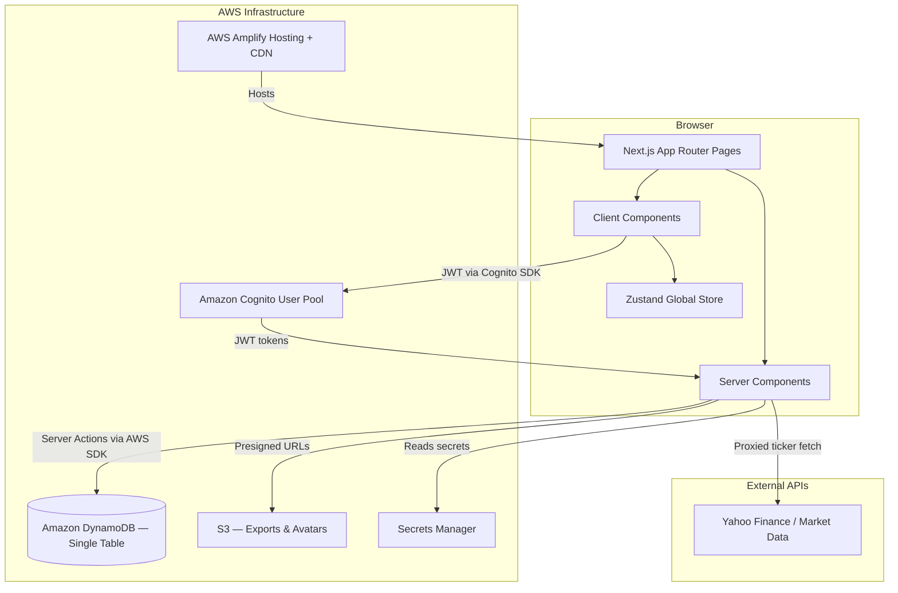
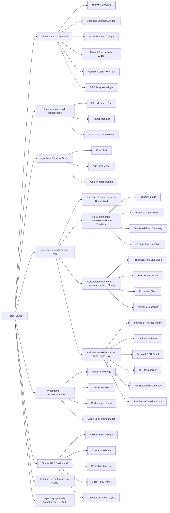
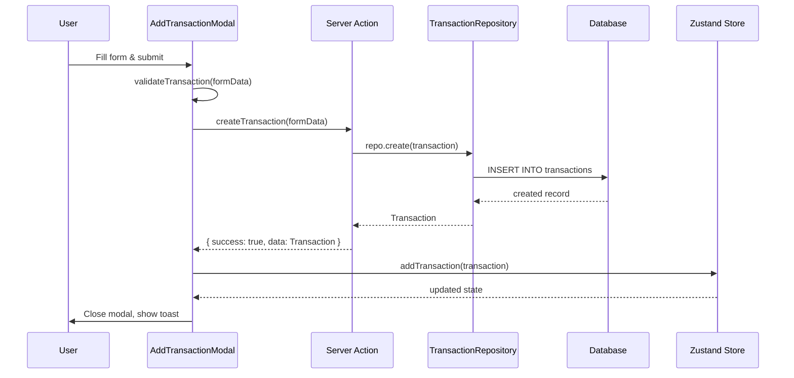
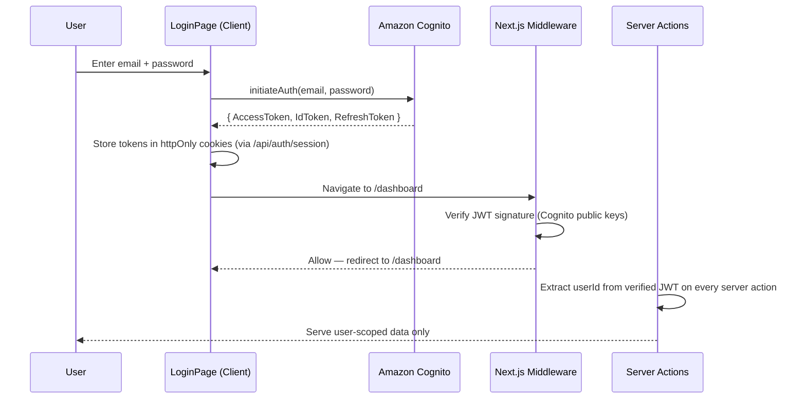
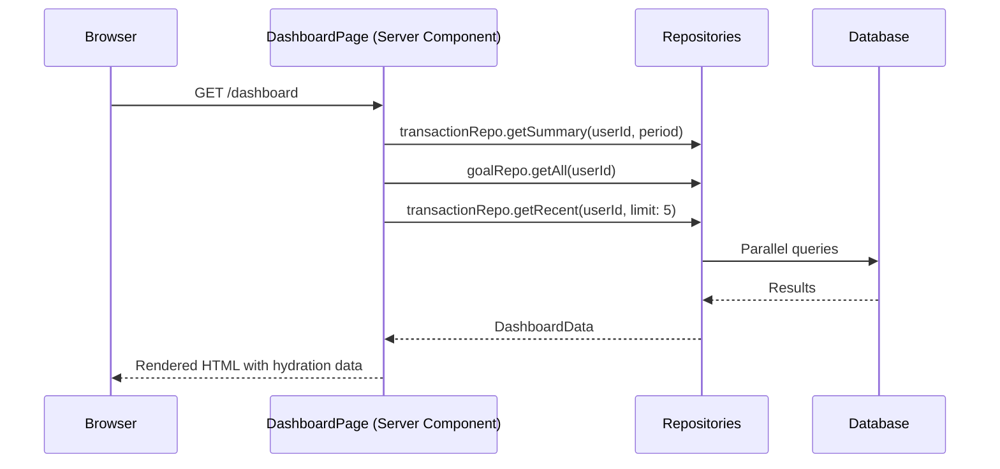
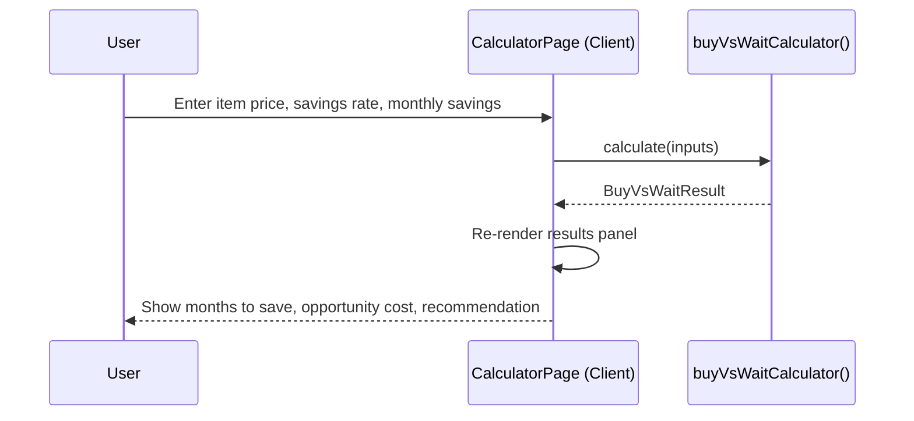
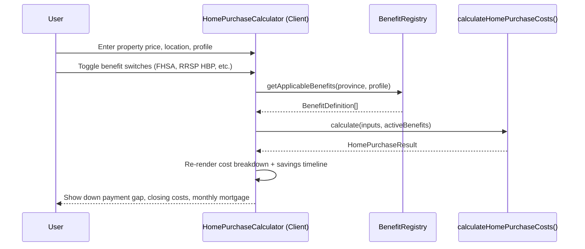
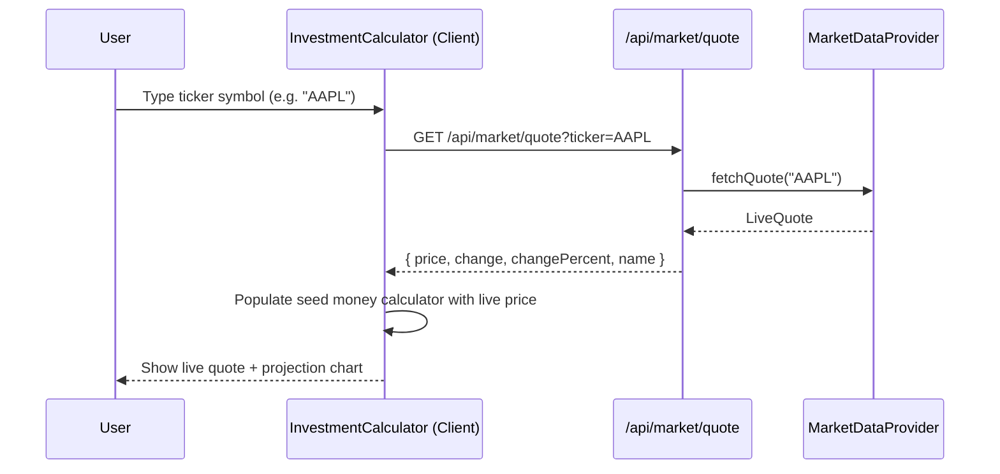
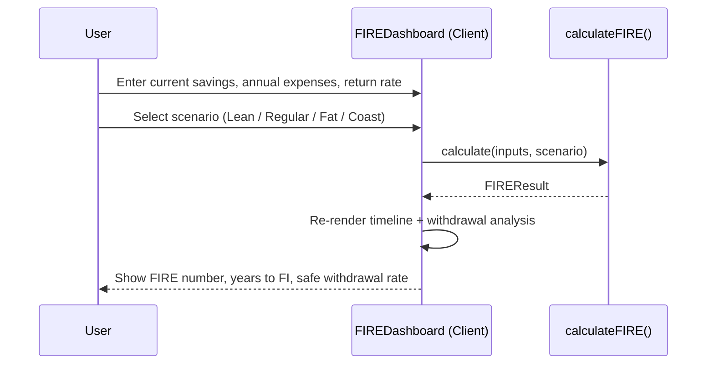
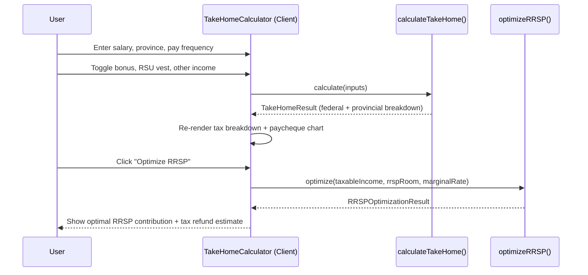

# Design Document: Moneymize

## Overview

Moneymize is a comprehensive personal finance dashboard built with Next.js and TypeScript. It gives users a single, clean interface to track income and expenses, set and monitor financial goals, plan major purchases like a home with jurisdiction-aware benefit calculators, analyse investments with live market data, chart a path to financial independence through FIRE planning, and calculate Canadian take-home pay with RRSP optimization.

User data is persisted securely in AWS — authentication via Amazon Cognito, data in DynamoDB (single-table design), and the app hosted on AWS Amplify. The infrastructure is 100% AWS-native, serverless, and scales to zero — the free tier covers personal use indefinitely.

The application is designed with production-grade scalability in mind — clear separation of concerns, typed data contracts throughout, a plugin-style benefit registry for government programs, and a component architecture that supports growth without rewrites.

The UI is built around a money-green accent colour with a full design token system, giving the product a distinctive, trustworthy feel. All pages are server-rendered where possible for performance, with client-side interactivity scoped to interactive widgets.

---

## Architecture

### High-Level System Architecture



### Page Structure



---

## Sequence Diagrams

### Adding a Transaction



### Authentication Flow



### Loading the Dashboard



### Buy vs Wait Calculation



### Home Purchase Calculation



### Live Ticker Fetch



### FIRE Projection



### Take-Home Pay Calculation



---

## AWS Infrastructure

### Service Selection Rationale

100% AWS-native, serverless, scales to zero. No always-on infrastructure.

| Service | Role | Why |
| --- | --- | --- |
| **AWS Amplify Hosting** | Next.js hosting + CDN | Native Next.js SSR support, global CDN, CI/CD from Git, pay-per-use |
| **Amazon Cognito (Lite tier)** | Authentication + user management | First 50,000 MAUs free; handles JWT, refresh tokens, password reset, email verification |
| **Amazon DynamoDB (on-demand)** | Primary database — single-table design | Always-free tier: 25 GB storage + ~200M requests/month; truly serverless, no cold starts |
| **Amazon S3** | CSV exports, profile avatars | $0.023/GB/mo; negligible at small scale |
| **AWS Secrets Manager** | Market API keys | $0.40/secret/mo; avoids hardcoded secrets |
| **Amazon SES** | Transactional email (verify, reset) | $0.10/1,000 emails; essentially free at low volume |

---

### DynamoDB Single-Table Design

DynamoDB rewards you when you model for your access patterns, not your entities. All Moneymize data lives in **one table** with a composite key (`PK` + `SK`) and a Global Secondary Index (`GSI1`) for reverse lookups.

#### Access Patterns

| # | Pattern | Key used |
| --- | --- | --- |
| 1 | Get user profile | `PK=USER#<userId>` `SK=PROFILE` |
| 2 | Get all transactions for a user | `PK=USER#<userId>` `SK begins_with TX#` |
| 3 | Get transactions by month | `PK=USER#<userId>` `SK begins_with TX#2025-06` |
| 4 | Get recent N transactions | `PK=USER#<userId>` `SK begins_with TX#` — query descending, limit N |
| 5 | Get single transaction | `PK=USER#<userId>` `SK=TX#<date>#<txId>` |
| 6 | Get all goals for a user | `PK=USER#<userId>` `SK begins_with GOAL#` |
| 7 | Get single goal | `PK=USER#<userId>` `SK=GOAL#<goalId>` |
| 8 | Get all holdings for a user | `PK=USER#<userId>` `SK begins_with HOLDING#` |
| 9 | Get monthly aggregates (cash flow chart) | `PK=USER#<userId>` `SK begins_with AGG#MONTH#` |
| 10 | Get saved calculator plans | `PK=USER#<userId>` `SK begins_with PLAN#<type>#` |
| 11 | Get FIRE plan | `PK=USER#<userId>` `SK=PLAN#FIRE#<planId>` |
| 12 | Get home purchase plan | `PK=USER#<userId>` `SK=PLAN#HOME#<planId>` |

All access patterns are single-partition reads or range queries on one partition — no cross-partition scans, no full table scans.

#### Table Structure

```
Table name: moneymize
Partition key (PK): String
Sort key (SK): String
Billing mode: PAY_PER_REQUEST (on-demand)
```

#### Item Shapes

```typescript
// src/lib/db/dynamo-types.ts

// ─── User Profile ────────────────────────────────────────────────────────────
// PK: USER#<cognitoSub>   SK: PROFILE
interface UserProfileItem {
  PK: string              // USER#<cognitoSub>
  SK: 'PROFILE'
  email: string
  currency: string        // 'CAD'
  locale: string          // 'en-CA'
  theme: 'light' | 'dark' | 'system'
  monthlyBudget?: number  // minor units
  createdAt: string       // ISO 8601
  updatedAt: string
}

// ─── Transaction ─────────────────────────────────────────────────────────────
// PK: USER#<userId>   SK: TX#<YYYY-MM-DD>#<txId>
// SK format ensures natural date-descending sort when queried in reverse
interface TransactionItem {
  PK: string              // USER#<userId>
  SK: string              // TX#2025-06-15#<uuid>
  txId: string            // uuid — for direct lookups
  type: 'income' | 'expense'
  amount: number          // minor units
  currency: string
  category: string
  description: string
  tags: string[]
  notes?: string
  createdAt: string
  updatedAt: string
}

// ─── Monthly Aggregate ───────────────────────────────────────────────────────
// Pre-computed per-month totals — updated on every transaction write
// PK: USER#<userId>   SK: AGG#MONTH#<YYYY-MM>
interface MonthlyAggregateItem {
  PK: string              // USER#<userId>
  SK: string              // AGG#MONTH#2025-06
  totalIncome: number     // minor units
  totalExpenses: number   // minor units
  netCashFlow: number     // minor units
  categoryBreakdown: Record<string, number>  // category → minor units
  transactionCount: number
  updatedAt: string
}

// ─── Goal ────────────────────────────────────────────────────────────────────
// PK: USER#<userId>   SK: GOAL#<goalId>
interface GoalItem {
  PK: string
  SK: string              // GOAL#<uuid>
  goalId: string
  name: string
  targetAmount: number    // minor units
  currentAmount: number   // minor units
  currency: string
  targetDate: string      // ISO 8601 date
  category: string
  colour: string          // hex
  notes?: string
  createdAt: string
  updatedAt: string
}

// ─── Portfolio Holding ───────────────────────────────────────────────────────
// PK: USER#<userId>   SK: HOLDING#<ticker>
interface HoldingItem {
  PK: string
  SK: string              // HOLDING#AAPL
  ticker: string
  name: string
  shares: number          // stored as string to avoid float precision issues
  averageCostBasis: number  // minor units per share
  currency: string
  createdAt: string
  updatedAt: string
}

// ─── Saved Calculator Plan ───────────────────────────────────────────────────
// PK: USER#<userId>   SK: PLAN#<type>#<planId>
// type: HOME | FIRE | INVESTMENT
interface CalculatorPlanItem {
  PK: string
  SK: string              // PLAN#HOME#<uuid>
  planId: string
  planType: 'HOME' | 'FIRE' | 'INVESTMENT'
  name: string            // user-given name, e.g. "Downtown Toronto Condo"
  inputs: string          // JSON-serialised inputs
  result: string          // JSON-serialised result snapshot
  createdAt: string
  updatedAt: string
}
```

#### Aggregate Maintenance Pattern

The `MonthlyAggregateItem` is the key to making the dashboard fast without SQL `GROUP BY`. Every time a transaction is created, updated, or deleted, a server action updates the corresponding monthly aggregate atomically using DynamoDB's `UpdateItem` with `ADD` expressions:

```typescript
// src/lib/db/aggregates.ts

import { UpdateCommand } from '@aws-sdk/lib-dynamodb'
import { docClient } from './dynamo-client'

export async function incrementMonthlyAggregate(
  userId: string,
  month: string,          // 'YYYY-MM'
  type: 'income' | 'expense',
  amount: number,         // minor units — positive to add, negative to subtract
  category: string,
): Promise<void> {
  const incomeAdd = type === 'income' ? amount : 0
  const expenseAdd = type === 'expense' ? amount : 0

  await docClient.send(new UpdateCommand({
    TableName: process.env.DYNAMODB_TABLE_NAME!,
    Key: {
      PK: `USER#${userId}`,
      SK: `AGG#MONTH#${month}`,
    },
    UpdateExpression: `
      ADD totalIncome :incomeAdd,
          totalExpenses :expenseAdd,
          netCashFlow :netAdd,
          transactionCount :one,
          categoryBreakdown.#cat :catAdd
    `,
    ExpressionAttributeNames: { '#cat': category },
    ExpressionAttributeValues: {
      ':incomeAdd': incomeAdd,
      ':expenseAdd': expenseAdd,
      ':netAdd': incomeAdd - expenseAdd,
      ':one': 1,
      ':catAdd': expenseAdd,
    },
  }))
}
```

This means the dashboard cash flow chart is a single `Query` on `AGG#MONTH#` items — no aggregation at read time, no expensive scans.

#### DynamoDB Client Setup

```typescript
// src/lib/db/dynamo-client.ts

import { DynamoDBClient } from '@aws-sdk/client-dynamodb'
import { DynamoDBDocumentClient } from '@aws-sdk/lib-dynamodb'

const client = new DynamoDBClient({
  region: process.env.AWS_REGION ?? 'us-east-1',
  // When running on Amplify, credentials come from the IAM execution role — no keys needed
  // When running locally, use AWS_PROFILE or AWS_ACCESS_KEY_ID env vars
})

export const docClient = DynamoDBDocumentClient.from(client, {
  marshallOptions: {
    removeUndefinedValues: true,
    convertEmptyValues: false,
  },
})

export const TABLE_NAME = process.env.DYNAMODB_TABLE_NAME!
```

---

### Authentication Architecture

Cognito handles the full auth lifecycle. The Next.js app never stores passwords — it only exchanges credentials with Cognito and receives JWTs.

```
Sign-up flow:
  User → Cognito (email + password) → Cognito sends verification email (via SES)
  User verifies → Cognito marks user confirmed → User can sign in

Sign-in flow:
  User → Cognito (email + password) → Cognito returns { AccessToken, IdToken, RefreshToken }
  App stores tokens in httpOnly, Secure, SameSite=Strict cookies
  Next.js middleware verifies JWT on every request using Cognito's JWKS endpoint
  Server actions extract userId from the verified IdToken — never from client input

Token refresh:
  Middleware detects expiring AccessToken (< 5 min remaining)
  Calls Cognito with RefreshToken → receives new AccessToken
  Updates cookie silently — user never sees a re-login prompt
```

**Cognito User Pool configuration:**

```typescript
// infrastructure/cognito.ts (CDK or manual console setup)

const userPool = {
  featurePlan: 'LITE',                    // free up to 50k MAUs
  signInAliases: { email: true },
  passwordPolicy: {
    minLength: 8,
    requireUppercase: true,
    requireNumbers: true,
    requireSymbols: false,
  },
  accountRecovery: 'EMAIL_ONLY',
  selfSignUpEnabled: true,
  autoVerify: { email: true },
  mfa: 'OPTIONAL',
  deletionProtection: true,
}
```

### Session Management

```typescript
// src/lib/auth/session.ts

import { cookies } from 'next/headers'
import { CognitoJwtVerifier } from 'aws-jwt-verify'

const verifier = CognitoJwtVerifier.create({
  userPoolId: process.env.COGNITO_USER_POOL_ID!,
  tokenUse: 'id',
  clientId: process.env.COGNITO_CLIENT_ID!,
})

export async function getSession(): Promise<Session | null> {
  const cookieStore = await cookies()
  const idToken = cookieStore.get('moneymize_id_token')?.value
  if (!idToken) return null

  try {
    const payload = await verifier.verify(idToken)
    return {
      userId: payload.sub,
      email: payload.email as string,
      expiresAt: new Date(payload.exp * 1000),
    }
  } catch {
    return null
  }
}

export interface Session {
  userId: string
  email: string
  expiresAt: Date
}
```

```typescript
// src/middleware.ts

import { NextResponse } from 'next/server'
import type { NextRequest } from 'next/server'
import { getSession } from '@/lib/auth/session'

const PUBLIC_PATHS = ['/', '/login', '/signup', '/api/auth']

export async function middleware(request: NextRequest) {
  const isPublic = PUBLIC_PATHS.some(p => request.nextUrl.pathname.startsWith(p))
  if (isPublic) return NextResponse.next()

  const session = await getSession()
  if (!session) {
    return NextResponse.redirect(new URL('/login', request.url))
  }

  return NextResponse.next()
}

export const config = {
  matcher: ['/((?!_next/static|_next/image|favicon.ico).*)'],
}
```

### Auth Pages

```
/login    — Email + password sign-in form
/signup   — Registration form (email, password, confirm password)
/verify   — Email verification code entry (post sign-up)
/forgot   — Password reset request (sends Cognito reset email)
/reset    — New password entry (with Cognito confirmation code)
```

---

## Colour System & Design Tokens

The entire colour palette is derived from a single money-green seed colour. All tokens are defined as CSS custom properties and consumed via Tailwind CSS config.

### Token Definitions

```typescript
// src/lib/design-tokens.ts

export const colorTokens = {
  // Primary — Money Green
  'green-50':  '#f0faf4',
  'green-100': '#d6f5e3',
  'green-200': '#aeebc8',
  'green-300': '#76d9a4',
  'green-400': '#3ec47e',
  'green-500': '#1aab62',  // ← Brand seed colour
  'green-600': '#128a4d',
  'green-700': '#0e6b3c',
  'green-800': '#0b5230',
  'green-900': '#073b22',

  // Neutrals — warm grey (complements green)
  'neutral-50':  '#f9fafb',
  'neutral-100': '#f3f4f6',
  'neutral-200': '#e5e7eb',
  'neutral-300': '#d1d5db',
  'neutral-400': '#9ca3af',
  'neutral-500': '#6b7280',
  'neutral-600': '#4b5563',
  'neutral-700': '#374151',
  'neutral-800': '#1f2937',
  'neutral-900': '#111827',

  // Semantic
  'income':  '#1aab62',   // green-500
  'expense': '#ef4444',   // red-500
  'warning': '#f59e0b',   // amber-500
  'info':    '#3b82f6',   // blue-500

  // Surface
  'surface-base':    '#ffffff',
  'surface-raised':  '#f9fafb',
  'surface-overlay': '#f3f4f6',
} as const

export type ColorToken = keyof typeof colorTokens
```

---

## Components and Interfaces

### Layout Components

#### `RootLayout`

**Purpose**: App shell — provides navigation sidebar, top bar, and theme context.

**Interface**:
```typescript
interface RootLayoutProps {
  children: React.ReactNode
}
```

**Responsibilities**:
- Render persistent sidebar navigation
- Inject CSS custom property tokens into `:root`
- Provide `ThemeProvider` context (light/dark mode)

---

#### `Sidebar`

**Purpose**: Primary navigation rail.

**Interface**:
```typescript
interface SidebarProps {
  currentPath: string
}

interface NavItem {
  label: string
  href: string
  icon: React.ComponentType<{ className?: string }>
  badge?: number  // e.g. unread notifications
}
```

---

### Dashboard Widgets

#### `NetWorthWidget`

**Purpose**: Displays total assets minus liabilities with a trend indicator.

**Interface**:
```typescript
interface NetWorthWidgetProps {
  netWorth: number
  previousNetWorth: number
  currency: CurrencyCode
  period: 'month' | 'quarter' | 'year'
}
```

---

#### `SpendingSummaryWidget`

**Purpose**: Doughnut chart of spending by category for the current period.

**Interface**:
```typescript
interface SpendingSummaryWidgetProps {
  breakdown: CategoryBreakdown[]
  totalSpent: number
  totalBudget?: number
  currency: CurrencyCode
}

interface CategoryBreakdown {
  category: TransactionCategory
  amount: number
  percentage: number
  colour: string
}
```

---

#### `CashFlowChart`

**Purpose**: Bar chart showing monthly income vs expenses over a rolling window.

**Interface**:
```typescript
interface CashFlowChartProps {
  data: MonthlyCashFlow[]
  currency: CurrencyCode
}

interface MonthlyCashFlow {
  month: string        // ISO "YYYY-MM"
  income: number
  expenses: number
  net: number
}
```

---

#### `GoalsProgressWidget`

**Purpose**: Compact list of active goals with progress bars.

**Interface**:
```typescript
interface GoalsProgressWidgetProps {
  goals: GoalSummary[]
  maxVisible?: number  // default 3
}

interface GoalSummary {
  id: string
  name: string
  targetAmount: number
  currentAmount: number
  targetDate: Date
  colour: string
}
```

---

#### `RecentTransactionsWidget`

**Purpose**: Last N transactions with category icon, amount, and date.

**Interface**:
```typescript
interface RecentTransactionsWidgetProps {
  transactions: Transaction[]
  currency: CurrencyCode
  onViewAll: () => void
}
```

---

### Transaction Components

#### `TransactionList`

**Purpose**: Virtualised, filterable list of all transactions.

**Interface**:
```typescript
interface TransactionListProps {
  transactions: Transaction[]
  currency: CurrencyCode
  onEdit: (id: string) => void
  onDelete: (id: string) => void
}
```

---

#### `TransactionForm`

**Purpose**: Controlled form for creating or editing a transaction.

**Interface**:
```typescript
interface TransactionFormProps {
  initialValues?: Partial<TransactionFormValues>
  onSubmit: (values: TransactionFormValues) => Promise<void>
  onCancel: () => void
  isLoading?: boolean
}

interface TransactionFormValues {
  type: 'income' | 'expense'
  amount: number
  category: TransactionCategory
  description: string
  date: Date
  tags?: string[]
  notes?: string
}
```

---

### Goal Components

#### `GoalCard`

**Purpose**: Full goal card with progress bar, projected completion date, and actions.

**Interface**:
```typescript
interface GoalCardProps {
  goal: Goal
  currency: CurrencyCode
  onAddFunds: (goalId: string, amount: number) => void
  onEdit: (goal: Goal) => void
  onDelete: (goalId: string) => void
}
```

---

#### `GoalForm`

**Purpose**: Form for creating or editing a financial goal.

**Interface**:
```typescript
interface GoalFormProps {
  initialValues?: Partial<GoalFormValues>
  onSubmit: (values: GoalFormValues) => Promise<void>
  onCancel: () => void
}

interface GoalFormValues {
  name: string
  targetAmount: number
  currentAmount: number
  targetDate: Date
  category: GoalCategory
  colour: string
  notes?: string
}
```

---

### Calculator Components

#### `BuyVsWaitCalculator`

**Purpose**: Interactive calculator with live-updating results.

**Interface**:

```typescript
interface BuyVsWaitCalculatorProps {
  currency: CurrencyCode
}

interface CalculatorInputs {
  itemPrice: number
  currentSavings: number
  monthlySavingsContribution: number
  expectedAnnualReturn: number   // % — opportunity cost of buying now
  inflationRate: number          // % — price appreciation if waiting
}
```

---

### Home Purchase Calculator Components

#### `HomePurchaseCalculator`

**Purpose**: Full-page calculator for planning a real estate purchase with jurisdiction-aware benefit toggles.

**Interface**:

```typescript
interface HomePurchaseCalculatorProps {
  currency: CurrencyCode
  defaultProvince?: CanadianProvince
}

interface HomePurchaseInputs {
  propertyPrice: number           // minor units
  province: CanadianProvince
  isFirstTimeBuyer: boolean
  annualIncome: number            // minor units — for FHSA/RRSP eligibility
  currentSavings: number          // minor units
  monthlySavings: number          // minor units
  amortizationYears: number       // 5–30
  mortgageRate: number            // decimal
  activeBenefitIds: string[]      // IDs from BenefitRegistry
}

type CanadianProvince =
  | 'AB' | 'BC' | 'MB' | 'NB' | 'NL'
  | 'NS' | 'NT' | 'NU' | 'ON' | 'PE'
  | 'QC' | 'SK' | 'YT'
```

---

#### `BenefitTogglePanel`

**Purpose**: Renders a list of applicable government benefit toggles, sourced from the `BenefitRegistry`. New benefits are added to the registry — this component needs no changes.

**Interface**:

```typescript
interface BenefitTogglePanelProps {
  benefits: BenefitDefinition[]
  activeBenefitIds: string[]
  onChange: (activeBenefitIds: string[]) => void
}

interface BenefitDefinition {
  id: string                      // e.g. "fhsa", "rrsp-hbp", "fthbi"
  label: string                   // e.g. "First Home Savings Account (FHSA)"
  description: string
  maxBenefit: number              // minor units — shown as hint
  eligibilityNote?: string
  learnMoreUrl?: string
  applicableProvinces: CanadianProvince[] | 'all'
  effectiveFrom: Date
  effectiveTo?: Date              // undefined = still active
  calculate: (inputs: HomePurchaseInputs) => number  // returns benefit amount in minor units
}
```

---

#### `HomePurchaseCostBreakdown`

**Purpose**: Itemised summary of all costs and offsets.

**Interface**:

```typescript
interface HomePurchaseCostBreakdownProps {
  result: HomePurchaseResult
  currency: CurrencyCode
}

interface HomePurchaseResult {
  propertyPrice: number
  minimumDownPayment: number
  recommendedDownPayment: number  // 20% to avoid CMHC
  cmhcPremium: number             // 0 if down >= 20%
  landTransferTax: number
  provincialLandTransferTax?: number  // e.g. ON has both municipal + provincial
  legalFees: number
  homeInspection: number
  movingCosts: number
  totalClosingCosts: number
  benefitOffsets: BenefitOffset[]
  netCashRequired: number         // after all benefits applied
  monthlyMortgagePayment: number
  monthsToSaveDownPayment: number
  projectedPurchaseDate: Date
}

interface BenefitOffset {
  benefitId: string
  label: string
  amount: number                  // minor units — positive = reduces cash needed
}
```

---

### Investment Calculator Components

#### `InvestmentCalculator`

**Purpose**: Seed money calculator with live ticker integration and compound growth projection.

**Interface**:

```typescript
interface InvestmentCalculatorProps {
  currency: CurrencyCode
}

interface InvestmentInputs {
  seedAmount: number              // minor units — initial lump sum
  monthlyContribution: number     // minor units
  annualReturnRate: number        // decimal
  years: number
  ticker?: string                 // optional — populates seedAmount from live price
  compoundingFrequency: 'monthly' | 'quarterly' | 'annually'
}

interface InvestmentResult {
  finalValue: number
  totalContributed: number
  totalGrowth: number
  growthPercentage: number
  yearlyBreakdown: YearlySnapshot[]
}

interface YearlySnapshot {
  year: number
  balance: number
  contributed: number
  growth: number
}
```

---

#### `TickerSearch`

**Purpose**: Debounced search input that fetches a live quote and populates the calculator.

**Interface**:

```typescript
interface TickerSearchProps {
  onQuoteSelected: (quote: LiveQuote) => void
  currency: CurrencyCode
}

interface LiveQuote {
  ticker: string
  name: string
  price: number                   // minor units
  change: number                  // minor units
  changePercent: number           // decimal
  currency: CurrencyCode
  exchange: string
  fetchedAt: Date
}
```

---

#### `PortfolioHoldings`

**Purpose**: Table of user-saved holdings with live price updates.

**Interface**:

```typescript
interface PortfolioHoldingsProps {
  holdings: Holding[]
  currency: CurrencyCode
  onAdd: () => void
  onEdit: (id: string) => void
  onDelete: (id: string) => void
}

interface Holding {
  id: string
  userId: string
  ticker: string
  name: string
  shares: number                  // decimal — supports fractional shares
  averageCostBasis: number        // minor units per share
  currency: CurrencyCode
  createdAt: Date
  updatedAt: Date
  // Enriched at runtime from market API:
  currentPrice?: number
  currentValue?: number
  gainLoss?: number
  gainLossPercent?: number
}
```

---

### FIRE Calculator Components

#### `FIREDashboard`

**Purpose**: Full FIRE planning page with scenario selector and projection timeline.

**Interface**:

```typescript
interface FIREDashboardProps {
  currency: CurrencyCode
}

interface FIREInputs {
  currentAge: number
  currentSavings: number          // minor units
  annualIncome: number            // minor units
  annualExpenses: number          // minor units
  annualSavingsContribution: number  // minor units
  expectedAnnualReturn: number    // decimal
  inflationRate: number           // decimal
  scenario: FIREScenario
  targetWithdrawalRate?: number   // decimal — default 0.04 (4% rule)
}

type FIREScenario = 'lean' | 'regular' | 'fat' | 'coast' | 'barista'

interface FIREResult {
  fireNumber: number              // minor units — target portfolio size
  yearsToFI: number
  projectedFIAge: number
  currentSavingsRate: number      // decimal
  requiredSavingsRate: number     // decimal — to hit target
  coastFIRENumber: number         // amount needed now to coast to FI without saving more
  coastFIREAge: number            // age at which you've hit coast FIRE
  withdrawalPhaseProjection: WithdrawalYear[]
  milestones: FIREMilestone[]
}

interface WithdrawalYear {
  age: number
  portfolioValue: number
  withdrawal: number
  inflationAdjustedWithdrawal: number
  portfolioSurvives: boolean
}

interface FIREMilestone {
  label: string                   // e.g. "25% FI", "Coast FIRE", "Half FI"
  targetAmount: number
  projectedAge: number
  reached: boolean
}
```

---

#### `FIREScenarioSelector`

**Purpose**: Toggle between FIRE variants with explanatory tooltips.

**Interface**:

```typescript
interface FIREScenarioSelectorProps {
  selected: FIREScenario
  onChange: (scenario: FIREScenario) => void
}

// Scenario definitions (static config, not a prop):
const FIRE_SCENARIOS: Record<FIREScenario, { label: string; description: string; multiplier: number }> = {
  lean:    { label: 'Lean FIRE',    description: 'Minimal lifestyle, ~$40k/yr',  multiplier: 25 },
  regular: { label: 'FIRE',         description: 'Standard 4% rule',             multiplier: 25 },
  fat:     { label: 'Fat FIRE',     description: 'Comfortable lifestyle, $100k+', multiplier: 33 },
  coast:   { label: 'Coast FIRE',   description: 'Save now, let it grow',         multiplier: 25 },
  barista: { label: 'Barista FIRE', description: 'Part-time income covers basics', multiplier: 25 },
}
```

---

### Take-Home Pay Calculator Components

#### `TakeHomeCalculator`

**Purpose**: Full-page Canadian take-home pay calculator supporting salary, bonus, RSU vests, and RRSP optimization. All tax logic is province-aware and driven by a versioned tax bracket registry — updating rates for a new tax year means adding one entry to the registry.

**Interface**:

```typescript
interface TakeHomeCalculatorProps {
  currency: CurrencyCode  // always 'CAD' for this calculator
}

interface TakeHomeInputs {
  // Core income
  province: CanadianProvince
  taxYear: number                     // e.g. 2025
  employmentIncome: number            // minor units — annual base salary
  payFrequency: PayFrequency

  // Additional income (all optional)
  bonusAmount?: number                // minor units — one-time bonus
  bonusPayPeriod?: number             // which pay period the bonus lands in (1-based)
  rsuVestAmount?: number              // minor units — FMV of RSUs vesting this year
  rsuAcbPerShare?: number             // minor units — adjusted cost basis per share
  otherIncome?: number                // minor units — freelance, rental, etc.

  // Deductions
  rrspContribution?: number           // minor units — manual override
  unionDues?: number                  // minor units — annual
  professionalFees?: number           // minor units — annual
  childcareExpenses?: number          // minor units — annual

  // Employer benefits (reduce taxable income)
  employerRRSPMatch?: number          // minor units — annual
  groupBenefitsPremium?: number       // minor units — employee portion (non-taxable)

  // Flags
  isQuebecResident: boolean           // QC has its own provincial tax return
  claimBasicPersonalAmount: boolean   // default true
}

type PayFrequency = 'weekly' | 'biweekly' | 'semi-monthly' | 'monthly'
```

---

#### `TakeHomeResult` (data shape, not a component)

```typescript
interface TakeHomeResult {
  // Annual figures
  grossIncome: number                 // minor units
  totalDeductions: number             // minor units
  taxableIncome: number               // minor units
  federalTax: number                  // minor units — before credits
  provincialTax: number               // minor units — before credits
  federalCredits: number              // minor units — BPA, CPP/EI credits
  provincialCredits: number           // minor units
  netFederalTax: number               // after credits
  netProvincialTax: number            // after credits
  cppContributions: number            // minor units
  eiPremiums: number                  // minor units
  totalTax: number                    // all taxes + CPP + EI
  netIncome: number                   // take-home after everything
  effectiveTaxRate: number            // decimal
  marginalFederalRate: number         // decimal — top federal bracket hit
  marginalProvincialRate: number      // decimal — top provincial bracket hit
  marginalCombinedRate: number        // federal + provincial marginal

  // Per-paycheque breakdown
  perPaycheque: PerPaychequeBreakdown

  // Bonus / RSU breakdown (if applicable)
  bonusTax?: IncomeTaxBreakdown
  rsuTax?: RSUTaxBreakdown

  // RRSP optimizer output (populated when optimizeRRSP is called)
  rrspOptimization?: RRSPOptimizationResult

  // Itemised federal bracket application
  federalBracketBreakdown: BracketApplication[]
  provincialBracketBreakdown: BracketApplication[]
}

interface PerPaychequeBreakdown {
  grossPay: number
  federalTaxWithheld: number
  provincialTaxWithheld: number
  cppWithheld: number
  eiWithheld: number
  rrspDeducted: number
  netPay: number
}

interface BracketApplication {
  bracketMin: number
  bracketMax: number | null           // null = no upper limit
  rate: number                        // decimal
  incomeInBracket: number             // minor units
  taxInBracket: number                // minor units
}

interface IncomeTaxBreakdown {
  grossAmount: number
  federalTax: number
  provincialTax: number
  cpp: number
  ei: number
  netAmount: number
  effectiveRate: number
}

interface RSUTaxBreakdown {
  vestFMV: number                     // fair market value at vest
  acb: number                         // adjusted cost basis
  employmentIncomePortion: number     // FMV - ACB = taxed as employment income
  federalTax: number
  provincialTax: number
  netProceeds: number
}
```

---

#### `TaxBracketRegistry`

The tax bracket registry is a versioned, data-driven store of federal and provincial rates. Adding a new tax year requires one new entry — no algorithm changes.

```typescript
// src/lib/calculators/take-home/tax-bracket-registry.ts

interface TaxBracketSet {
  year: number
  jurisdiction: 'federal' | CanadianProvince
  brackets: TaxBracket[]
  basicPersonalAmount: number         // minor units
  surtaxThresholds?: SurtaxThreshold[] // ON, PEI have surtax
}

interface TaxBracket {
  min: number                         // minor units — income floor
  max: number | null                  // minor units — null = no ceiling
  rate: number                        // decimal
}

interface SurtaxThreshold {
  threshold: number                   // minor units
  rate: number                        // decimal — applied on top of provincial tax
}

// CPP & EI rates are also versioned
interface CPPRates {
  year: number
  employeeRate: number                // decimal (2025: 0.0595)
  maximumPensionableEarnings: number  // minor units (2025: $7,140,000)
  basicExemption: number             // minor units ($350,000)
  cpp2EmployeeRate: number           // decimal — second additional CPP (2025: 0.04)
  cpp2Ceiling: number                // minor units
}

interface EIRates {
  year: number
  employeeRate: number                // decimal (2025: 0.01664)
  maximumInsurableEarnings: number    // minor units (2025: $6,390,000)
  quebecEmployeeRate: number          // QC has lower EI (QPIP covers parental)
}
```

---

#### `RRSPOptimizer`

**Purpose**: Given the user's taxable income and available RRSP room, calculates the optimal RRSP contribution to minimise total tax — targeting the point where the next dollar contributed drops the user into a lower marginal bracket.

**Interface**:

```typescript
interface RRSPOptimizerProps {
  result: TakeHomeResult
  availableRRSPRoom: number           // minor units — from NOA or user input
  currency: CurrencyCode
  onApply: (contribution: number) => void
}

interface RRSPOptimizationResult {
  currentTaxableIncome: number
  currentTotalTax: number
  optimalContribution: number         // minor units — recommended RRSP contribution
  taxableIncomeAfter: number
  totalTaxAfter: number
  taxRefundEstimate: number           // currentTotalTax - totalTaxAfter
  marginalRateBeforeContribution: number
  marginalRateAfterContribution: number
  dropsIntoBracket: boolean           // true if contribution crosses a bracket boundary
  contributionScenarios: ContributionScenario[]  // $5k, $10k, $15k, optimal, max room
}

interface ContributionScenario {
  label: string                       // e.g. "$10,000", "Optimal", "Max Room"
  contribution: number
  taxRefund: number
  netCostOfContribution: number       // contribution - taxRefund (true out-of-pocket cost)
  newMarginalRate: number
}
```

---

---

## Benefit Registry (Scalability Pattern)

Government programs change — new ones get introduced, existing ones get modified or sunset. The `BenefitRegistry` is a static, data-driven registry that decouples benefit logic from UI components. Adding a new program (e.g. a future "First Home Tax Credit") means adding one entry to the registry file. No component code changes required.

```typescript
// src/lib/calculators/home-purchase/benefit-registry.ts

import type { BenefitDefinition } from '@/types/home-purchase'

export const BENEFIT_REGISTRY: BenefitDefinition[] = [
  {
    id: 'fhsa',
    label: 'First Home Savings Account (FHSA)',
    description: 'Tax-free savings account for first-time home buyers. Contributions are tax-deductible; withdrawals for a qualifying home purchase are tax-free.',
    maxBenefit: 4000000,          // $40,000 lifetime limit in minor units
    eligibilityNote: 'Must be a first-time buyer and Canadian resident',
    learnMoreUrl: 'https://www.canada.ca/en/revenue-agency/services/tax/individuals/topics/first-home-savings-account.html',
    applicableProvinces: 'all',
    effectiveFrom: new Date('2023-04-01'),
    calculate: (inputs) => {
      if (!inputs.isFirstTimeBuyer) return 0
      // Benefit = min(accumulated FHSA balance, $40,000) — user inputs their balance
      return Math.min(inputs.fhsaBalance ?? 0, 4000000)
    },
  },
  {
    id: 'rrsp-hbp',
    label: 'RRSP Home Buyers\' Plan (HBP)',
    description: 'Withdraw up to $35,000 from your RRSP tax-free for a first home purchase. Must be repaid over 15 years.',
    maxBenefit: 3500000,          // $35,000 in minor units
    eligibilityNote: 'First-time buyer; RRSP funds must have been in the account for 90+ days',
    learnMoreUrl: 'https://www.canada.ca/en/revenue-agency/services/tax/individuals/topics/rrsps-related-plans/what-home-buyers-plan.html',
    applicableProvinces: 'all',
    effectiveFrom: new Date('1992-01-01'),
    calculate: (inputs) => {
      if (!inputs.isFirstTimeBuyer) return 0
      return Math.min(inputs.rrspBalance ?? 0, 3500000)
    },
  },
  {
    id: 'fthbi',
    label: 'First-Time Home Buyer Incentive (FTHBI)',
    description: 'Shared-equity mortgage with the Government of Canada — 5% or 10% of the home purchase price.',
    maxBenefit: 0,                // variable — computed from property price
    eligibilityNote: 'Household income ≤ $120,000; purchase price ≤ $500,000',
    applicableProvinces: 'all',
    effectiveFrom: new Date('2019-09-02'),
    effectiveTo: new Date('2024-03-21'),  // program ended
    calculate: (inputs) => {
      if (!inputs.isFirstTimeBuyer) return 0
      if (inputs.annualIncome > 12000000) return 0  // $120k limit
      if (inputs.propertyPrice > 50000000) return 0  // $500k limit
      const isNewConstruction = inputs.propertyType === 'new-construction'
      const rate = isNewConstruction ? 0.10 : 0.05
      return Math.round(inputs.propertyPrice * rate)
    },
  },
  {
    id: 'land-transfer-tax-rebate-on',
    label: 'Ontario First-Time Buyer Land Transfer Tax Rebate',
    description: 'Rebate of up to $4,000 on Ontario land transfer tax for first-time buyers.',
    maxBenefit: 400000,           // $4,000 in minor units
    applicableProvinces: ['ON'],
    effectiveFrom: new Date('2017-01-01'),
    calculate: (inputs) => {
      if (!inputs.isFirstTimeBuyer) return 0
      if (!['ON'].includes(inputs.province)) return 0
      return Math.min(calculateOntarioLTT(inputs.propertyPrice), 400000)
    },
  },
  // ← New benefits are added here. No other files change.
]

// Helper — not exported, used only within registry entries
function calculateOntarioLTT(price: number): number {
  // Ontario LTT brackets (2024)
  let tax = 0
  if (price > 55000) tax += Math.min(price - 55000, 195000) * 0.01
  if (price > 250000) tax += Math.min(price - 250000, 150000) * 0.015
  if (price > 400000) tax += Math.min(price - 400000, 1600000) * 0.02
  if (price > 2000000) tax += (price - 2000000) * 0.025
  return Math.round(tax)
}
```

---

## Market Data API Layer

Live ticker data is fetched server-side through a provider-agnostic adapter. The concrete provider (Yahoo Finance via `yahoo-finance2`, Alpha Vantage, or Polygon.io) is swapped by changing one environment variable — all consumers use the same `MarketDataProvider` interface.

```typescript
// src/lib/market/market-data-provider.ts

export interface MarketDataProvider {
  getQuote(ticker: string): Promise<LiveQuote>
  searchTickers(query: string): Promise<TickerSearchResult[]>
  getHistoricalPrices(ticker: string, from: Date, to: Date): Promise<HistoricalPrice[]>
}

export interface LiveQuote {
  ticker: string
  name: string
  price: number                   // minor units
  change: number                  // minor units
  changePercent: number           // decimal
  currency: CurrencyCode
  exchange: string
  marketCap?: number
  fiftyTwoWeekHigh?: number
  fiftyTwoWeekLow?: number
  fetchedAt: Date
}

export interface TickerSearchResult {
  ticker: string
  name: string
  exchange: string
  type: 'equity' | 'etf' | 'crypto' | 'index'
}

export interface HistoricalPrice {
  date: Date
  open: number
  high: number
  low: number
  close: number
  volume: number
}
```

```typescript
// src/lib/market/providers/yahoo-finance-provider.ts
// Concrete implementation — swap this file to change data source

import yahooFinance from 'yahoo-finance2'
import type { MarketDataProvider, LiveQuote } from '../market-data-provider'

export class YahooFinanceProvider implements MarketDataProvider {
  async getQuote(ticker: string): Promise<LiveQuote> {
    const quote = await yahooFinance.quote(ticker)
    return {
      ticker: quote.symbol,
      name: quote.longName ?? quote.shortName ?? ticker,
      price: Math.round((quote.regularMarketPrice ?? 0) * 100),
      change: Math.round((quote.regularMarketChange ?? 0) * 100),
      changePercent: (quote.regularMarketChangePercent ?? 0) / 100,
      currency: (quote.currency ?? 'USD') as CurrencyCode,
      exchange: quote.fullExchangeName ?? '',
      fetchedAt: new Date(),
    }
  }
  // ... searchTickers, getHistoricalPrices
}
```

```typescript
// src/lib/market/get-market-provider.ts
// Factory — reads MARKET_DATA_PROVIDER env var

export function getMarketProvider(): MarketDataProvider {
  const provider = process.env.MARKET_DATA_PROVIDER ?? 'yahoo'
  switch (provider) {
    case 'yahoo':    return new YahooFinanceProvider()
    case 'polygon':  return new PolygonProvider()
    default:         return new YahooFinanceProvider()
  }
}
```

Route handler with caching:

```typescript
// src/app/api/market/quote/route.ts

import { getMarketProvider } from '@/lib/market/get-market-provider'
import { unstable_cache } from 'next/cache'

const getCachedQuote = unstable_cache(
  async (ticker: string) => getMarketProvider().getQuote(ticker),
  ['market-quote'],
  { revalidate: 60, tags: ['market-data'] }  // 60-second cache
)

export async function GET(request: Request) {
  const { searchParams } = new URL(request.url)
  const ticker = searchParams.get('ticker')?.toUpperCase()
  if (!ticker) return Response.json({ error: 'ticker required' }, { status: 400 })

  try {
    const quote = await getCachedQuote(ticker)
    return Response.json(quote)
  } catch {
    return Response.json({ error: 'Quote unavailable' }, { status: 502 })
  }
}
```

---

## Data Models

### `Transaction`

```typescript
interface Transaction {
  id: string                      // UUID v4
  userId: string
  type: 'income' | 'expense'
  amount: number                  // stored in minor units (cents)
  currency: CurrencyCode
  category: TransactionCategory
  description: string
  date: Date
  tags: string[]
  notes?: string
  createdAt: Date
  updatedAt: Date
}

type TransactionCategory =
  | 'housing'
  | 'food'
  | 'transport'
  | 'health'
  | 'entertainment'
  | 'shopping'
  | 'utilities'
  | 'education'
  | 'savings'
  | 'investment'
  | 'salary'
  | 'freelance'
  | 'gift'
  | 'other'
```

---

### `Goal`

```typescript
interface Goal {
  id: string
  userId: string
  name: string
  targetAmount: number            // minor units
  currentAmount: number           // minor units
  currency: CurrencyCode
  targetDate: Date
  category: GoalCategory
  colour: string                  // hex colour for UI
  notes?: string
  createdAt: Date
  updatedAt: Date
}

type GoalCategory =
  | 'emergency-fund'
  | 'vacation'
  | 'home'
  | 'vehicle'
  | 'education'
  | 'retirement'
  | 'investment'
  | 'debt-payoff'
  | 'other'
```

---

### `UserPreferences`

```typescript
interface UserPreferences {
  userId: string
  currency: CurrencyCode
  locale: string                  // e.g. "en-AU"
  theme: 'light' | 'dark' | 'system'
  dashboardLayout: DashboardWidgetConfig[]
  monthlyBudget?: number          // minor units
  createdAt: Date
  updatedAt: Date
}

interface DashboardWidgetConfig {
  widgetId: string
  position: number
  visible: boolean
}

type CurrencyCode = 'USD' | 'EUR' | 'GBP' | 'AUD' | 'CAD' | 'NZD' | string
```

---

### `BudgetRule` (optional envelope budgeting)

```typescript
interface BudgetRule {
  id: string
  userId: string
  category: TransactionCategory
  monthlyLimit: number            // minor units
  rollover: boolean               // carry unused budget to next month
  createdAt: Date
  updatedAt: Date
}
```

---

### `Holding`

```typescript
interface Holding {
  id: string
  userId: string
  ticker: string
  name: string
  shares: number                  // decimal — supports fractional shares
  averageCostBasis: number        // minor units per share
  currency: CurrencyCode
  createdAt: Date
  updatedAt: Date
}
```

---

### `HomePurchasePlan`

Persisted snapshot of a home purchase calculation so users can save and revisit scenarios.

```typescript
interface HomePurchasePlan {
  id: string
  userId: string
  name: string                    // e.g. "Downtown Toronto Condo"
  inputs: HomePurchaseInputs
  result: HomePurchaseResult
  createdAt: Date
  updatedAt: Date
}
```

---

### `FIREPlan`

```typescript
interface FIREPlan {
  id: string
  userId: string
  name: string                    // e.g. "Regular FIRE at 45"
  inputs: FIREInputs
  result: FIREResult
  createdAt: Date
  updatedAt: Date
}
```

---

## Algorithmic Pseudocode

### Buy vs Wait Calculator

```pascal
ALGORITHM calculateBuyVsWait(inputs)
INPUT:
  itemPrice: number (minor units)
  currentSavings: number (minor units)
  monthlySavingsContribution: number (minor units)
  expectedAnnualReturn: number (decimal, e.g. 0.07)
  inflationRate: number (decimal, e.g. 0.03)
OUTPUT: BuyVsWaitResult

PRECONDITIONS:
  itemPrice > 0
  monthlySavingsContribution >= 0
  expectedAnnualReturn >= 0
  inflationRate >= 0

BEGIN
  monthlyReturn ← (1 + expectedAnnualReturn) ^ (1/12) - 1
  monthlyInflation ← (1 + inflationRate) ^ (1/12) - 1

  // Scenario A: Buy now on credit / from savings
  opportunityCostBuyNow ← itemPrice × expectedAnnualReturn

  // Scenario B: Save until you can afford it
  monthsToSave ← 0
  savings ← currentSavings
  adjustedPrice ← itemPrice

  WHILE savings < adjustedPrice AND monthsToSave < 600 DO
    savings ← savings × (1 + monthlyReturn) + monthlySavingsContribution
    adjustedPrice ← adjustedPrice × (1 + monthlyInflation)
    monthsToSave ← monthsToSave + 1
  END WHILE

  IF monthsToSave >= 600 THEN
    RETURN { feasible: false, reason: "Goal unreachable at current savings rate" }
  END IF

  investmentGainIfWait ← savings - (currentSavings + monthlySavingsContribution × monthsToSave)
  priceDifferenceIfWait ← adjustedPrice - itemPrice

  recommendation ← IF priceDifferenceIfWait > investmentGainIfWait
                   THEN "buy-now"
                   ELSE "wait"

  RETURN {
    feasible: true,
    monthsToSave,
    adjustedPriceAtPurchase: adjustedPrice,
    investmentGainIfWait,
    opportunityCostBuyNow,
    recommendation
  }
END

POSTCONDITIONS:
  IF result.feasible THEN result.monthsToSave >= 0
  result.recommendation ∈ { "buy-now", "wait" }
```

---

### Transaction Summary Aggregation

```pascal
ALGORITHM aggregateTransactions(transactions, period)
INPUT:
  transactions: Transaction[]
  period: { start: Date, end: Date }
OUTPUT: TransactionSummary

PRECONDITIONS:
  period.start <= period.end
  ALL t IN transactions: t.date >= period.start AND t.date <= period.end

BEGIN
  totalIncome ← 0
  totalExpenses ← 0
  categoryMap ← empty Map<TransactionCategory, number>

  FOR each transaction t IN transactions DO
    ASSERT t.amount > 0

    IF t.type = "income" THEN
      totalIncome ← totalIncome + t.amount
    ELSE
      totalExpenses ← totalExpenses + t.amount
      current ← categoryMap.get(t.category) OR 0
      categoryMap.set(t.category, current + t.amount)
    END IF
  END FOR

  // Build sorted breakdown
  breakdown ← []
  FOR each [category, amount] IN categoryMap DO
    breakdown.append({
      category,
      amount,
      percentage: (amount / totalExpenses) × 100
    })
  END FOR

  SORT breakdown BY amount DESCENDING

  RETURN {
    totalIncome,
    totalExpenses,
    netCashFlow: totalIncome - totalExpenses,
    savingsRate: IF totalIncome > 0 THEN ((totalIncome - totalExpenses) / totalIncome) × 100 ELSE 0,
    breakdown
  }
END

POSTCONDITIONS:
  result.netCashFlow = result.totalIncome - result.totalExpenses
  SUM(breakdown[i].amount) = result.totalExpenses
  SUM(breakdown[i].percentage) ≈ 100 (within floating point tolerance)
```

---

### Goal Projection

```pascal
ALGORITHM projectGoalCompletion(goal, monthlyContribution, annualReturn)
INPUT:
  goal: Goal
  monthlyContribution: number (minor units)
  annualReturn: number (decimal)
OUTPUT: GoalProjection

PRECONDITIONS:
  goal.targetAmount > goal.currentAmount
  monthlyContribution >= 0
  annualReturn >= 0

BEGIN
  monthlyRate ← (1 + annualReturn) ^ (1/12) - 1
  balance ← goal.currentAmount
  months ← 0
  milestones ← []

  WHILE balance < goal.targetAmount AND months < 1200 DO
    balance ← balance × (1 + monthlyRate) + monthlyContribution
    months ← months + 1

    // Record 25%, 50%, 75% milestones
    progress ← balance / goal.targetAmount
    IF progress IN { 0.25, 0.50, 0.75 } AND NOT already recorded THEN
      milestones.append({ progress, month: months })
    END IF
  END WHILE

  projectedDate ← today + months months
  onTrack ← projectedDate <= goal.targetDate

  RETURN {
    projectedCompletionDate: projectedDate,
    monthsRemaining: months,
    onTrack,
    shortfallMonths: IF NOT onTrack THEN months - monthsBetween(today, goal.targetDate) ELSE 0,
    milestones
  }
END

POSTCONDITIONS:
  IF result.onTrack THEN result.projectedCompletionDate <= goal.targetDate
  result.monthsRemaining >= 0
```

---

### Home Purchase Cost Calculation

```pascal
ALGORITHM calculateHomePurchaseCosts(inputs, activeBenefits)
INPUT:
  inputs: HomePurchaseInputs
  activeBenefits: BenefitDefinition[]
OUTPUT: HomePurchaseResult

PRECONDITIONS:
  inputs.propertyPrice > 0
  inputs.amortizationYears IN [5..30]
  inputs.mortgageRate >= 0

BEGIN
  // 1. Minimum down payment (CMHC rules)
  IF inputs.propertyPrice <= 50000000 THEN          // <= $500,000
    minimumDown ← inputs.propertyPrice × 0.05
  ELSE IF inputs.propertyPrice <= 99999900 THEN     // $500k–$999,999
    minimumDown ← 2500000 + (inputs.propertyPrice - 50000000) × 0.10
  ELSE                                               // >= $1,000,000
    minimumDown ← inputs.propertyPrice × 0.20
  END IF

  recommendedDown ← inputs.propertyPrice × 0.20

  // 2. CMHC mortgage insurance premium
  downPaymentRatio ← inputs.downPayment / inputs.propertyPrice
  IF downPaymentRatio < 0.20 THEN
    IF downPaymentRatio < 0.10 THEN cmhcRate ← 0.0315
    ELSE IF downPaymentRatio < 0.15 THEN cmhcRate ← 0.028
    ELSE cmhcRate ← 0.024
    cmhcPremium ← (inputs.propertyPrice - inputs.downPayment) × cmhcRate
  ELSE
    cmhcPremium ← 0
  END IF

  // 3. Land transfer taxes (province-specific)
  provincialLTT ← calculateProvincialLTT(inputs.propertyPrice, inputs.province)
  municipalLTT ← IF inputs.province = 'ON' AND inputs.city = 'Toronto'
                 THEN calculateTorontoMunicipalLTT(inputs.propertyPrice)
                 ELSE 0

  // 4. Fixed closing costs
  legalFees ← 150000          // ~$1,500 estimate
  homeInspection ← 50000      // ~$500 estimate
  movingCosts ← 200000        // ~$2,000 estimate
  titleInsurance ← 30000      // ~$300 estimate

  totalClosingCosts ← provincialLTT + municipalLTT + legalFees +
                      homeInspection + movingCosts + titleInsurance + cmhcPremium

  // 5. Apply active benefits
  benefitOffsets ← []
  FOR each benefit IN activeBenefits DO
    amount ← benefit.calculate(inputs)
    IF amount > 0 THEN
      benefitOffsets.append({ benefitId: benefit.id, label: benefit.label, amount })
    END IF
  END FOR

  totalBenefits ← SUM(benefitOffsets[i].amount)
  netCashRequired ← inputs.downPayment + totalClosingCosts - totalBenefits

  // 6. Monthly mortgage payment (standard amortisation formula)
  principal ← inputs.propertyPrice - inputs.downPayment + cmhcPremium
  monthlyRate ← inputs.mortgageRate / 12
  n ← inputs.amortizationYears × 12
  monthlyPayment ← principal × (monthlyRate × (1 + monthlyRate)^n) / ((1 + monthlyRate)^n - 1)

  // 7. Months to save required cash
  monthsToSave ← 0
  savings ← inputs.currentSavings
  WHILE savings < netCashRequired AND monthsToSave < 600 DO
    savings ← savings + inputs.monthlySavings
    monthsToSave ← monthsToSave + 1
  END WHILE

  RETURN {
    propertyPrice: inputs.propertyPrice,
    minimumDownPayment: minimumDown,
    recommendedDownPayment: recommendedDown,
    cmhcPremium,
    landTransferTax: provincialLTT,
    provincialLandTransferTax: municipalLTT,
    legalFees, homeInspection, movingCosts,
    totalClosingCosts,
    benefitOffsets,
    netCashRequired,
    monthlyMortgagePayment: monthlyPayment,
    monthsToSaveDownPayment: monthsToSave,
    projectedPurchaseDate: today + monthsToSave months
  }
END

POSTCONDITIONS:
  result.netCashRequired >= 0
  result.monthlyMortgagePayment > 0
  SUM(result.benefitOffsets[i].amount) <= result.totalClosingCosts + result.propertyPrice
```

---

### FIRE Number Calculation

```pascal
ALGORITHM calculateFIRE(inputs)
INPUT:
  inputs: FIREInputs
OUTPUT: FIREResult

PRECONDITIONS:
  inputs.currentAge > 0
  inputs.annualExpenses > 0
  inputs.expectedAnnualReturn >= 0
  inputs.targetWithdrawalRate > 0

BEGIN
  // 1. FIRE number (portfolio size needed to sustain withdrawals indefinitely)
  fireNumber ← inputs.annualExpenses / inputs.targetWithdrawalRate

  // 2. Years to FI via compound growth + contributions
  balance ← inputs.currentSavings
  years ← 0
  yearlyBreakdown ← []
  milestones ← []

  WHILE balance < fireNumber AND years < 100 DO
    growth ← balance × inputs.expectedAnnualReturn
    balance ← balance + growth + inputs.annualSavingsContribution
    years ← years + 1

    yearlyBreakdown.append({
      year: years,
      balance,
      contributed: inputs.annualSavingsContribution,
      growth
    })

    // Record milestones at 25%, 50%, 75%, Coast FIRE
    progress ← balance / fireNumber
    FOR each threshold IN { 0.25, 0.50, 0.75 } DO
      IF progress >= threshold AND NOT already recorded THEN
        milestones.append({ label: threshold×100 + "% FI", targetAmount: fireNumber×threshold,
                            projectedAge: inputs.currentAge + years, reached: true })
      END IF
    END FOR
  END WHILE

  // 3. Coast FIRE — amount needed NOW to reach fireNumber by retirement age (65) with no more contributions
  retirementAge ← 65
  yearsToRetirement ← retirementAge - inputs.currentAge
  coastFIRENumber ← fireNumber / (1 + inputs.expectedAnnualReturn) ^ yearsToRetirement

  coastFIREAge ← inputs.currentAge
  coastBalance ← inputs.currentSavings
  WHILE coastBalance < coastFIRENumber AND coastFIREAge < retirementAge DO
    coastBalance ← coastBalance × (1 + inputs.expectedAnnualReturn) + inputs.annualSavingsContribution
    coastFIREAge ← coastFIREAge + 1
  END WHILE

  // 4. Withdrawal phase simulation (30-year Monte Carlo simplified as deterministic)
  withdrawalPhase ← []
  portfolioValue ← fireNumber
  annualWithdrawal ← inputs.annualExpenses
  FOR age FROM (inputs.currentAge + years) TO (inputs.currentAge + years + 30) DO
    portfolioValue ← portfolioValue × (1 + inputs.expectedAnnualReturn) - annualWithdrawal
    inflationAdjustedWithdrawal ← annualWithdrawal × (1 + inputs.inflationRate)
    withdrawalPhase.append({
      age,
      portfolioValue: MAX(portfolioValue, 0),
      withdrawal: annualWithdrawal,
      inflationAdjustedWithdrawal,
      portfolioSurvives: portfolioValue > 0
    })
    annualWithdrawal ← inflationAdjustedWithdrawal
  END FOR

  currentSavingsRate ← (inputs.annualSavingsContribution / inputs.annualIncome) × 100
  requiredSavingsRate ← ((fireNumber - inputs.currentSavings) / (inputs.annualIncome × years)) × 100

  RETURN {
    fireNumber,
    yearsToFI: years,
    projectedFIAge: inputs.currentAge + years,
    currentSavingsRate,
    requiredSavingsRate,
    coastFIRENumber,
    coastFIREAge,
    withdrawalPhaseProjection: withdrawalPhase,
    milestones
  }
END

POSTCONDITIONS:
  result.fireNumber = inputs.annualExpenses / inputs.targetWithdrawalRate
  result.projectedFIAge = inputs.currentAge + result.yearsToFI
  result.coastFIRENumber <= result.fireNumber
```

---

### Compound Investment Projection

```pascal
ALGORITHM calculateInvestmentGrowth(inputs)
INPUT:
  inputs: InvestmentInputs
OUTPUT: InvestmentResult

PRECONDITIONS:
  inputs.seedAmount >= 0
  inputs.years > 0
  inputs.annualReturnRate >= 0
  inputs.compoundingFrequency IN { 'monthly', 'quarterly', 'annually' }

BEGIN
  periodsPerYear ← CASE inputs.compoundingFrequency OF
    'monthly':    12
    'quarterly':  4
    'annually':   1
  END CASE

  periodRate ← inputs.annualReturnRate / periodsPerYear
  totalPeriods ← inputs.years × periodsPerYear
  contributionPerPeriod ← inputs.monthlyContribution × (12 / periodsPerYear)

  balance ← inputs.seedAmount
  totalContributed ← inputs.seedAmount
  yearlyBreakdown ← []

  FOR period FROM 1 TO totalPeriods DO
    balance ← balance × (1 + periodRate) + contributionPerPeriod
    totalContributed ← totalContributed + contributionPerPeriod

    IF period MOD periodsPerYear = 0 THEN
      year ← period / periodsPerYear
      yearlyBreakdown.append({
        year,
        balance,
        contributed: totalContributed,
        growth: balance - totalContributed
      })
    END IF
  END FOR

  RETURN {
    finalValue: balance,
    totalContributed,
    totalGrowth: balance - totalContributed,
    growthPercentage: ((balance - totalContributed) / totalContributed) × 100,
    yearlyBreakdown
  }
END

POSTCONDITIONS:
  result.totalGrowth = result.finalValue - result.totalContributed
  result.finalValue >= inputs.seedAmount
  LENGTH(result.yearlyBreakdown) = inputs.years
```

---

### Canadian Take-Home Pay Calculation

```pascal
ALGORITHM calculateTakeHome(inputs, taxBracketRegistry, cppRates, eiRates)
INPUT:
  inputs: TakeHomeInputs
  taxBracketRegistry: TaxBracketSet[]
  cppRates: CPPRates
  eiRates: EIRates
OUTPUT: TakeHomeResult

PRECONDITIONS:
  inputs.employmentIncome >= 0
  inputs.taxYear >= 2020
  inputs.province IS valid CanadianProvince
  federalBrackets ← taxBracketRegistry WHERE year = inputs.taxYear AND jurisdiction = 'federal'
  provincialBrackets ← taxBracketRegistry WHERE year = inputs.taxYear AND jurisdiction = inputs.province
  ASSERT federalBrackets IS NOT NULL
  ASSERT provincialBrackets IS NOT NULL

BEGIN
  // 1. Aggregate gross income
  grossIncome ← inputs.employmentIncome
               + (inputs.bonusAmount OR 0)
               + (inputs.rsuVestAmount - inputs.rsuAcbPerShare OR 0)  // employment income portion
               + (inputs.otherIncome OR 0)

  // 2. Deductions (reduce taxable income)
  totalDeductions ← (inputs.rrspContribution OR 0)
                  + (inputs.unionDues OR 0)
                  + (inputs.professionalFees OR 0)
                  + (inputs.childcareExpenses OR 0)

  taxableIncome ← MAX(grossIncome - totalDeductions, 0)

  // 3. CPP contributions (employment income only, not investment income)
  cppBase ← MIN(inputs.employmentIncome, cppRates.maximumPensionableEarnings)
           - cppRates.basicExemption
  cpp1 ← MAX(cppBase, 0) × cppRates.employeeRate
  cpp2Base ← MIN(inputs.employmentIncome, cppRates.cpp2Ceiling)
            - cppRates.maximumPensionableEarnings
  cpp2 ← MAX(cpp2Base, 0) × cppRates.cpp2EmployeeRate
  totalCPP ← cpp1 + cpp2

  // 4. EI premiums
  eiRate ← IF inputs.isQuebecResident THEN eiRates.quebecEmployeeRate ELSE eiRates.employeeRate
  totalEI ← MIN(inputs.employmentIncome, eiRates.maximumInsurableEarnings) × eiRate

  // 5. Federal tax — apply brackets progressively
  federalTax ← 0
  federalBracketBreakdown ← []
  FOR each bracket IN federalBrackets.brackets DO
    incomeInBracket ← MAX(MIN(taxableIncome, bracket.max OR ∞) - bracket.min, 0)
    taxInBracket ← incomeInBracket × bracket.rate
    federalTax ← federalTax + taxInBracket
    federalBracketBreakdown.append({ ...bracket, incomeInBracket, taxInBracket })
  END FOR

  // 6. Federal non-refundable credits
  bpaFederal ← IF inputs.claimBasicPersonalAmount THEN federalBrackets.basicPersonalAmount ELSE 0
  cppCreditFederal ← totalCPP                    // CPP/EI are creditable at lowest bracket rate
  eiCreditFederal ← totalEI
  federalCredits ← (bpaFederal + cppCreditFederal + eiCreditFederal) × federalBrackets.brackets[0].rate
  netFederalTax ← MAX(federalTax - federalCredits, 0)

  // 7. Provincial tax — same progressive approach
  provincialTax ← 0
  provincialBracketBreakdown ← []
  FOR each bracket IN provincialBrackets.brackets DO
    incomeInBracket ← MAX(MIN(taxableIncome, bracket.max OR ∞) - bracket.min, 0)
    taxInBracket ← incomeInBracket × bracket.rate
    provincialTax ← provincialTax + taxInBracket
    provincialBracketBreakdown.append({ ...bracket, incomeInBracket, taxInBracket })
  END FOR

  // 7a. Ontario / PEI surtax (applied on top of provincial tax)
  IF provincialBrackets.surtaxThresholds IS NOT NULL THEN
    surtax ← 0
    FOR each threshold IN provincialBrackets.surtaxThresholds DO
      surtax ← surtax + MAX(provincialTax - threshold.threshold, 0) × threshold.rate
    END FOR
    provincialTax ← provincialTax + surtax
  END IF

  // 8. Provincial non-refundable credits
  bpaProvincial ← IF inputs.claimBasicPersonalAmount THEN provincialBrackets.basicPersonalAmount ELSE 0
  provincialCredits ← (bpaProvincial + totalCPP + totalEI) × provincialBrackets.brackets[0].rate
  netProvincialTax ← MAX(provincialTax - provincialCredits, 0)

  // 9. Totals
  totalTax ← netFederalTax + netProvincialTax + totalCPP + totalEI
  netIncome ← grossIncome - totalTax - totalDeductions
  effectiveTaxRate ← IF grossIncome > 0 THEN totalTax / grossIncome ELSE 0

  // 10. Marginal rates — find the highest bracket with income > bracket.min
  marginalFederalRate ← LAST bracket IN federalBrackets WHERE taxableIncome > bracket.min
  marginalProvincialRate ← LAST bracket IN provincialBrackets WHERE taxableIncome > bracket.min

  // 11. Per-paycheque breakdown
  periodsPerYear ← CASE inputs.payFrequency OF
    'weekly': 52  'biweekly': 26  'semi-monthly': 24  'monthly': 12
  END CASE
  perPaycheque ← {
    grossPay: grossIncome / periodsPerYear,
    federalTaxWithheld: netFederalTax / periodsPerYear,
    provincialTaxWithheld: netProvincialTax / periodsPerYear,
    cppWithheld: totalCPP / periodsPerYear,
    eiWithheld: totalEI / periodsPerYear,
    rrspDeducted: (inputs.rrspContribution OR 0) / periodsPerYear,
    netPay: netIncome / periodsPerYear
  }

  RETURN {
    grossIncome, totalDeductions, taxableIncome,
    federalTax, provincialTax, federalCredits, provincialCredits,
    netFederalTax, netProvincialTax,
    cppContributions: totalCPP, eiPremiums: totalEI,
    totalTax, netIncome, effectiveTaxRate,
    marginalFederalRate, marginalProvincialRate,
    marginalCombinedRate: marginalFederalRate + marginalProvincialRate,
    perPaycheque,
    federalBracketBreakdown, provincialBracketBreakdown
  }
END

POSTCONDITIONS:
  result.netIncome = result.grossIncome - result.totalTax - result.totalDeductions
  result.effectiveTaxRate IN [0, 1]
  result.marginalCombinedRate = result.marginalFederalRate + result.marginalProvincialRate
  result.totalTax = result.netFederalTax + result.netProvincialTax
                  + result.cppContributions + result.eiPremiums
```

---

### RRSP Optimization

```pascal
ALGORITHM optimizeRRSP(currentResult, availableRRSPRoom)
INPUT:
  currentResult: TakeHomeResult
  availableRRSPRoom: number (minor units)
OUTPUT: RRSPOptimizationResult

PRECONDITIONS:
  availableRRSPRoom >= 0
  currentResult.taxableIncome > 0

BEGIN
  // Find the contribution that drops the user to the next lower bracket boundary
  currentMarginalRate ← currentResult.marginalCombinedRate
  currentTaxableIncome ← currentResult.taxableIncome

  // Identify the current bracket floor — contribution to reach it = optimal
  federalBrackets ← sorted federal brackets for current tax year
  provincialBrackets ← sorted provincial brackets for current tax year

  // Find the nearest lower bracket boundary across both federal and provincial
  nearestBoundary ← MAX(
    LAST federal bracket WHERE bracket.min < currentTaxableIncome,
    LAST provincial bracket WHERE bracket.min < currentTaxableIncome
  )

  optimalContribution ← MIN(
    currentTaxableIncome - nearestBoundary,
    availableRRSPRoom
  )

  // Build scenarios: $5k, $10k, $15k, $20k, optimal, max room
  scenarioAmounts ← [500000, 1000000, 1500000, 2000000, optimalContribution, availableRRSPRoom]
  scenarioAmounts ← DEDUPLICATE and SORT scenarioAmounts
  scenarioAmounts ← FILTER WHERE amount <= availableRRSPRoom AND amount > 0

  contributionScenarios ← []
  FOR each amount IN scenarioAmounts DO
    newTaxableIncome ← MAX(currentTaxableIncome - amount, 0)
    newTax ← recalculateTax(newTaxableIncome, federalBrackets, provincialBrackets)
    taxRefund ← currentResult.totalTax - newTax
    contributionScenarios.append({
      label: IF amount = optimalContribution THEN "Optimal"
             ELSE IF amount = availableRRSPRoom THEN "Max Room"
             ELSE formatCurrency(amount),
      contribution: amount,
      taxRefund,
      netCostOfContribution: amount - taxRefund,
      newMarginalRate: getMarginalRate(newTaxableIncome, federalBrackets, provincialBrackets)
    })
  END FOR

  newTaxAfterOptimal ← recalculateTax(currentTaxableIncome - optimalContribution, ...)

  RETURN {
    currentTaxableIncome,
    currentTotalTax: currentResult.totalTax,
    optimalContribution,
    taxableIncomeAfter: currentTaxableIncome - optimalContribution,
    totalTaxAfter: newTaxAfterOptimal,
    taxRefundEstimate: currentResult.totalTax - newTaxAfterOptimal,
    marginalRateBeforeContribution: currentMarginalRate,
    marginalRateAfterContribution: getMarginalRate(currentTaxableIncome - optimalContribution, ...),
    dropsIntoBracket: newMarginalRate < currentMarginalRate,
    contributionScenarios
  }
END

POSTCONDITIONS:
  result.optimalContribution <= availableRRSPRoom
  result.taxRefundEstimate >= 0
  result.taxableIncomeAfter = result.currentTaxableIncome - result.optimalContribution
  result.totalTaxAfter <= result.currentTotalTax
```

---

## Key Functions with Formal Specifications

### `formatCurrency(amount, currency, locale)`

```typescript
function formatCurrency(
  amount: number,        // minor units (cents)
  currency: CurrencyCode,
  locale: string
): string
```

**Preconditions:**
- `amount` is a finite integer
- `currency` is a valid ISO 4217 code
- `locale` is a valid BCP 47 locale string

**Postconditions:**
- Returns a non-empty string
- String contains the currency symbol appropriate for `locale`
- Negative amounts are represented with a leading minus or parentheses per locale convention
- Amount is divided by 100 before formatting (minor units → major units)

**Loop Invariants:** N/A

---

### `validateTransaction(values)`

```typescript
function validateTransaction(
  values: Partial<TransactionFormValues>
): ValidationResult
```

**Preconditions:**
- `values` is a defined object (may have missing fields)

**Postconditions:**
- Returns `{ valid: true }` if and only if all required fields are present and valid
- Returns `{ valid: false, errors: Record<string, string> }` with at least one error entry when invalid
- `errors` keys correspond exactly to invalid field names
- No mutations to `values`

---

### `calculateSavingsRate(income, expenses)`

```typescript
function calculateSavingsRate(income: number, expenses: number): number
```

**Preconditions:**
- `income >= 0`
- `expenses >= 0`

**Postconditions:**
- Returns a number in range `[0, 100]` representing percentage
- If `income === 0`, returns `0`
- If `expenses > income`, returns `0` (no negative savings rate displayed)
- Result is rounded to 1 decimal place

---

### `getDateRange(period)`

```typescript
function getDateRange(
  period: 'week' | 'month' | 'quarter' | 'year' | 'custom',
  customRange?: { start: Date; end: Date }
): { start: Date; end: Date }
```

**Preconditions:**
- If `period === 'custom'`, `customRange` must be defined and `customRange.start <= customRange.end`

**Postconditions:**
- Returns `{ start, end }` where `start <= end`
- For non-custom periods, `end` is always the current date (end of day)
- For `'month'`, `start` is the first day of the current calendar month
- For `'week'`, `start` is the most recent Monday

---

## State Management

Zustand is used for client-side global state. Server state (fetched data) is managed via React Server Components and Next.js caching — Zustand only holds UI state and optimistic updates.

### Store Shape

```typescript
// src/store/finance-store.ts

interface FinanceStore {
  // UI State
  selectedPeriod: DatePeriod
  activeCurrency: CurrencyCode
  sidebarCollapsed: boolean

  // Optimistic transaction cache (cleared on server revalidation)
  pendingTransactions: Transaction[]

  // Actions
  setSelectedPeriod: (period: DatePeriod) => void
  setActiveCurrency: (currency: CurrencyCode) => void
  toggleSidebar: () => void
  addPendingTransaction: (t: Transaction) => void
  clearPendingTransactions: () => void
}

type DatePeriod = 'week' | 'month' | 'quarter' | 'year'
```

### Store Implementation Pattern

```typescript
import { create } from 'zustand'
import { persist } from 'zustand/middleware'

export const useFinanceStore = create<FinanceStore>()(
  persist(
    (set) => ({
      selectedPeriod: 'month',
      activeCurrency: 'USD',
      sidebarCollapsed: false,
      pendingTransactions: [],

      setSelectedPeriod: (period) => set({ selectedPeriod: period }),
      setActiveCurrency: (currency) => set({ activeCurrency: currency }),
      toggleSidebar: () => set((s) => ({ sidebarCollapsed: !s.sidebarCollapsed })),
      addPendingTransaction: (t) =>
        set((s) => ({ pendingTransactions: [...s.pendingTransactions, t] })),
      clearPendingTransactions: () => set({ pendingTransactions: [] }),
    }),
    { name: 'moneymize-ui-state', partialize: (s) => ({ selectedPeriod: s.selectedPeriod, activeCurrency: s.activeCurrency }) }
  )
)
```

---

## Repository Layer

All data access goes through typed repository interfaces. The concrete implementation uses `@aws-sdk/lib-dynamodb` with the `DynamoDBDocumentClient`. The interface is identical regardless of the underlying store — swapping DynamoDB for another backend requires only changing the concrete class.

```typescript
// src/lib/repositories/transaction-repository.ts

interface TransactionRepository {
  findById(userId: string, txId: string): Promise<Transaction | null>
  findAll(userId: string, filters?: TransactionFilters): Promise<Transaction[]>
  getRecent(userId: string, limit: number): Promise<Transaction[]>
  getSummary(userId: string, period: DateRange): Promise<TransactionSummary>
  getMonthlyCashFlow(userId: string, months: number): Promise<MonthlyCashFlow[]>
  create(data: Omit<Transaction, 'id' | 'createdAt' | 'updatedAt'>): Promise<Transaction>
  update(userId: string, txId: string, data: Partial<TransactionFormValues>): Promise<Transaction>
  delete(userId: string, txId: string): Promise<void>
}

interface TransactionFilters {
  type?: 'income' | 'expense'
  category?: TransactionCategory
  dateRange?: DateRange
  search?: string
  tags?: string[]
  minAmount?: number
  maxAmount?: number
}

interface DateRange {
  start: Date
  end: Date
}
```

```typescript
// src/lib/repositories/goal-repository.ts

interface GoalRepository {
  findById(userId: string, goalId: string): Promise<Goal | null>
  findAll(userId: string): Promise<Goal[]>
  create(data: Omit<Goal, 'id' | 'createdAt' | 'updatedAt'>): Promise<Goal>
  update(userId: string, goalId: string, data: Partial<GoalFormValues>): Promise<Goal>
  addFunds(userId: string, goalId: string, amount: number): Promise<Goal>
  delete(userId: string, goalId: string): Promise<void>
}
```

### DynamoDB Repository Implementation Pattern

```typescript
// src/lib/repositories/dynamo/transaction-repository.ts

import { QueryCommand, PutCommand, UpdateCommand, DeleteCommand } from '@aws-sdk/lib-dynamodb'
import { docClient, TABLE_NAME } from '@/lib/db/dynamo-client'
import { v4 as uuidv4 } from 'uuid'
import type { TransactionRepository, Transaction, TransactionFilters } from '../transaction-repository'

export class DynamoTransactionRepository implements TransactionRepository {

  async getRecent(userId: string, limit: number): Promise<Transaction[]> {
    const result = await docClient.send(new QueryCommand({
      TableName: TABLE_NAME,
      KeyConditionExpression: 'PK = :pk AND begins_with(SK, :prefix)',
      ExpressionAttributeValues: {
        ':pk': `USER#${userId}`,
        ':prefix': 'TX#',
      },
      ScanIndexForward: false,   // descending — most recent first
      Limit: limit,
    }))
    return (result.Items ?? []).map(this.fromItem)
  }

  async getMonthlyCashFlow(userId: string, months: number): Promise<MonthlyCashFlow[]> {
    // Reads pre-computed AGG#MONTH# items — O(months) reads, no aggregation
    const result = await docClient.send(new QueryCommand({
      TableName: TABLE_NAME,
      KeyConditionExpression: 'PK = :pk AND begins_with(SK, :prefix)',
      ExpressionAttributeValues: {
        ':pk': `USER#${userId}`,
        ':prefix': 'AGG#MONTH#',
      },
      ScanIndexForward: false,
      Limit: months,
    }))
    return (result.Items ?? []).map(item => ({
      month: item.SK.replace('AGG#MONTH#', ''),
      income: item.totalIncome,
      expenses: item.totalExpenses,
      net: item.netCashFlow,
    }))
  }

  async create(data: Omit<Transaction, 'id' | 'createdAt' | 'updatedAt'>): Promise<Transaction> {
    const txId = uuidv4()
    const now = new Date().toISOString()
    const datePrefix = data.date.toISOString().slice(0, 10)  // YYYY-MM-DD
    const month = data.date.toISOString().slice(0, 7)         // YYYY-MM

    const item = {
      PK: `USER#${data.userId}`,
      SK: `TX#${datePrefix}#${txId}`,
      txId,
      ...data,
      createdAt: now,
      updatedAt: now,
    }

    // Transactional write: create item + update monthly aggregate atomically
    await docClient.send(new TransactWriteCommand({
      TransactItems: [
        { Put: { TableName: TABLE_NAME, Item: item } },
        {
          Update: {
            TableName: TABLE_NAME,
            Key: { PK: `USER#${data.userId}`, SK: `AGG#MONTH#${month}` },
            UpdateExpression: 'ADD totalIncome :inc, totalExpenses :exp, netCashFlow :net, transactionCount :one',
            ExpressionAttributeValues: {
              ':inc': data.type === 'income' ? data.amount : 0,
              ':exp': data.type === 'expense' ? data.amount : 0,
              ':net': data.type === 'income' ? data.amount : -data.amount,
              ':one': 1,
            },
          },
        },
      ],
    }))

    return this.fromItem(item)
  }

  private fromItem(item: Record<string, unknown>): Transaction {
    // Map DynamoDB item shape back to domain Transaction type
    return {
      id: item.txId as string,
      userId: (item.PK as string).replace('USER#', ''),
      type: item.type as 'income' | 'expense',
      amount: item.amount as number,
      currency: item.currency as string,
      category: item.category as TransactionCategory,
      description: item.description as string,
      date: new Date(item.SK as string).split('#')[1],
      tags: item.tags as string[],
      notes: item.notes as string | undefined,
      createdAt: new Date(item.createdAt as string),
      updatedAt: new Date(item.updatedAt as string),
    }
  }
}
```

---

## Error Handling

### Error Scenario 1: Transaction Creation Failure

**Condition**: Server action fails to persist a transaction (DB error, validation failure)
**Response**: Return `{ success: false, error: string }` from the server action; display a toast notification with the error message
**Recovery**: Form remains open with values intact; user can retry

### Error Scenario 2: Data Fetch Failure on Dashboard

**Condition**: A repository query throws during server-side rendering
**Response**: Each widget is wrapped in an `<ErrorBoundary>` with a fallback card showing "Unable to load data"
**Recovery**: User can refresh the page; other widgets remain functional

### Error Scenario 3: Invalid Calculator Inputs

**Condition**: User enters non-numeric or out-of-range values in the Buy vs Wait calculator
**Response**: Inline validation messages appear below each field; calculation does not run until inputs are valid
**Recovery**: User corrects inputs; results update automatically

### Error Scenario 4: Goal Overfunding

**Condition**: User attempts to add funds that would exceed the goal target
**Response**: Warn the user with a confirmation dialog showing the overage amount
**Recovery**: User can confirm (cap at target) or cancel and enter a different amount

### Error Scenario 5: Market API Unavailable

**Condition**: The market data provider returns an error or times out
**Response**: Return a 502 from the route handler; the `TickerSearch` component shows "Quote unavailable — enter price manually" and falls back to a manual price input field
**Recovery**: User can enter the price manually; the calculator continues to function fully without live data

### Error Scenario 6: Benefit Registry — Expired Program Selected

**Condition**: A benefit with an `effectiveTo` date in the past is toggled on (e.g. FTHBI ended March 2024)
**Response**: The `BenefitTogglePanel` renders expired benefits with a greyed-out "Ended [date]" badge and disables the toggle
**Recovery**: No action needed — expired benefits are display-only and cannot be activated

### Error Scenario 7: Take-Home — Missing Tax Brackets for Tax Year

**Condition**: User selects a tax year for which no bracket data exists in the registry
**Response**: Fall back to the most recent available year and display a banner: "Using [year] rates — [selected year] rates not yet available"
**Recovery**: Automatic fallback; user is informed of the approximation

### Error Scenario 8: RRSP Room Exceeds Contribution Limit

**Condition**: User enters an RRSP room figure that exceeds the CRA annual maximum ($31,560 for 2025)
**Response**: Inline warning: "This exceeds the [year] annual RRSP limit of $X. Verify your NOA for your actual available room."
**Recovery**: Calculation proceeds with the entered value — it may be valid if the user has significant carry-forward room

---

## Testing Strategy

### Unit Testing Approach

Pure utility functions (`calculateBuyVsWait`, `aggregateTransactions`, `projectGoalCompletion`, `formatCurrency`, `calculateSavingsRate`) are unit tested with Vitest. Each function has tests for happy path, edge cases (zero values, boundary conditions), and error cases.

### Property-Based Testing Approach

**Property Test Library**: fast-check

Key properties to verify:

- `formatCurrency(amount, currency, locale)` — for any finite integer `amount`, the output always contains the major-unit representation (amount / 100)
- `aggregateTransactions(txns, period)` — `netCashFlow` always equals `totalIncome - totalExpenses` regardless of transaction set
- `calculateSavingsRate(income, expenses)` — result is always in `[0, 100]` for any non-negative inputs
- `calculateBuyVsWait(inputs)` — if `monthlyContribution > 0` and `itemPrice` is finite, `feasible` is always `true`
- `projectGoalCompletion(goal, contribution, return)` — `projectedCompletionDate` is always in the future when `monthsRemaining > 0`
- `calculateFIRE(inputs)` — `fireNumber` always equals `annualExpenses / withdrawalRate` for any valid inputs
- `calculateInvestmentGrowth(inputs)` — `finalValue >= seedAmount` for any non-negative return rate
- `calculateHomePurchaseCosts(inputs, [])` — `netCashRequired` equals `downPayment + totalClosingCosts` when no benefits are active
- `calculateTakeHome(inputs)` — `netIncome` always equals `grossIncome - totalTax - totalDeductions` for any valid province/year combination
- `calculateTakeHome(inputs)` — `totalTax` always equals `netFederalTax + netProvincialTax + cppContributions + eiPremiums`
- `optimizeRRSP(result, room)` — `optimalContribution` is always `<= availableRRSPRoom` and `taxRefundEstimate >= 0`

### Integration Testing Approach

Server actions and repository methods are integration tested against an in-memory SQLite instance (using `better-sqlite3`). Tests cover the full create → read → update → delete lifecycle for transactions and goals.

### Component Testing

React components are tested with React Testing Library. Key scenarios: form validation feedback, widget rendering with mock data, calculator live-update behaviour.

---

## Performance Considerations

- Dashboard widgets that require heavy aggregation are computed server-side and cached with `unstable_cache` (Next.js) with a 60-second TTL, revalidated on transaction mutation via `revalidateTag`.
- The transaction list uses `react-window` for virtualisation when the list exceeds 100 items.
- Charts use `recharts` (lightweight, tree-shakeable) rather than heavier alternatives.
- All images and icons use Next.js `<Image>` and SVG sprites respectively.
- The Buy vs Wait, Investment, and FIRE calculators run entirely client-side with no network round-trip.
- Live market quotes are cached server-side for 60 seconds via `unstable_cache` — the client never calls the external market API directly, preventing API key exposure and rate limit issues.
- The `BenefitRegistry` is a static array evaluated at module load time — zero runtime cost for benefit lookups.
- FIRE withdrawal phase simulation is capped at 30 years deterministically; a future Monte Carlo upgrade can be added behind a feature flag without changing the component interface.

---

## Security Considerations

- All server actions validate input server-side using `zod` schemas — client-side validation is UX only.
- User IDs are always sourced from the verified Cognito JWT, never from client-supplied parameters.
- Monetary amounts are stored and computed in minor units (integers) to avoid floating-point precision errors.
- All DynamoDB operations use the `PK=USER#<userId>` partition key derived from the verified JWT — a user can only ever read or write their own partition.
- Market API keys are stored in AWS Secrets Manager and injected as environment variables at runtime — never exposed to the browser. All ticker requests are proxied through `/api/market/*` route handlers.
- External market API responses are validated with a Zod schema before use — malformed responses are rejected rather than passed to the UI.
- Auth tokens (AccessToken, IdToken, RefreshToken) are stored in **httpOnly, Secure, SameSite=Strict** cookies — inaccessible to JavaScript, preventing XSS token theft.
- JWT verification uses `aws-jwt-verify` with Cognito's JWKS endpoint — tokens are verified cryptographically on every server action, not just at login.
- DynamoDB access is granted via an IAM execution role attached to the Amplify service — no access keys or connection strings in environment variables for the database itself.
- Database credentials are not needed — DynamoDB uses IAM authentication, eliminating the credential rotation problem entirely.

---

## Dependencies

| Package | Purpose |
| --- | --- |
| `next` | App framework (App Router) |
| `react` / `react-dom` | UI rendering |
| `typescript` | Type safety |
| `tailwindcss` | Utility-first styling |
| `zustand` | Client-side UI state |
| `zod` | Runtime schema validation |
| `recharts` | Charts (cash flow, spending breakdown, FIRE timeline) |
| `react-window` | Virtualised transaction list |
| `date-fns` | Date arithmetic and formatting |
| `better-sqlite3` | Local SQLite database (dev / self-hosted) |
| `@radix-ui/react-*` | Accessible headless UI primitives (modals, dropdowns, toggles) |
| `lucide-react` | Icon set |
| `fast-check` | Property-based testing |
| `vitest` | Unit & integration test runner |
| `@testing-library/react` | Component testing |
| `uuid` | UUID v4 generation |
| `yahoo-finance2` | Default market data provider (server-side only) |
| `decimal.js` | Arbitrary-precision arithmetic for tax bracket calculations |
| `@aws-sdk/client-dynamodb` | DynamoDB low-level client |
| `@aws-sdk/lib-dynamodb` | DynamoDB Document client — marshals JS types automatically |
| `@aws-sdk/client-ses` | Send transactional emails via SES |
| `aws-jwt-verify` | Verify Cognito JWTs server-side without a round-trip |
| `amazon-cognito-identity-js` | Cognito auth SDK (client-side sign-in/sign-up) |

---

## Estimated Monthly AWS Cost

All figures are for **us-east-1** (N. Virginia) as of May 2025. The database is **Amazon DynamoDB** on-demand — 100% AWS-native.

### DynamoDB Free Tier (Always Free — Never Expires)

```
25 GB storage
25 provisioned WCU + 25 provisioned RCU
≈ 200 million requests/month
```

A personal finance app for hundreds of users will comfortably stay within this forever.

### Cost Breakdown

| Service | Config | Just you / dev | ~100 MAUs/mo | ~1,000 MAUs/mo |
| --- | --- | --- | --- | --- |
| **Amplify Hosting** | SSR + CDN, ~2–5 GB bandwidth | ~$0.30 | ~$0.75 | ~$3.00 |
| **Cognito (Lite tier)** | First 50,000 MAUs free | **$0.00** | **$0.00** | **$0.00** |
| **DynamoDB (on-demand)** | Always-free tier | **$0.00** | **$0.00** | **$0.00–1.00** |
| **S3** | Exports + avatars, ~0.5 GB | ~$0.02 | ~$0.03 | ~$0.10 |
| **Secrets Manager** | 1 secret (market API key) @ $0.40 | $0.40 | $0.40 | $0.40 |
| **SES** | Email verification + resets | ~$0.01 | ~$0.01 | ~$0.10 |
| **CloudWatch Logs** | Basic app logs | ~$0.10 | ~$0.50 | ~$1.00 |
| **TOTAL** | | **~$0.85/mo** | **~$1.70/mo** | **~$5–6/mo** |

### Comparison: All Three Options

| Scale | RDS (original) | Neon | DynamoDB |
| --- | --- | --- | --- |
| Personal / dev | ~$16/mo | ~$1.25/mo | **~$0.85/mo** |
| ~100 users | ~$19/mo | ~$3/mo | **~$1.70/mo** |
| ~1,000 users | ~$19/mo | ~$10/mo | **~$5/mo** |
| 100% AWS-native | ✅ | ❌ | **✅** |
| No cold starts | ✅ | ❌ | **✅** |
| Free tier never expires | ❌ | ❌ | **✅** |

### Notes

- **DynamoDB's always-free tier never expires** — unlike RDS free tier (12 months only). At personal/small-team scale you may never pay for the database at all.
- **No connection pool management** — DynamoDB uses HTTP, not persistent TCP connections. No pool exhaustion, no connection limits to worry about.
- **Secrets Manager reduced to 1 secret** — DynamoDB credentials come from the Amplify IAM execution role (no connection string needed), so only the market API key needs Secrets Manager.
- **Scale-up path:** If you exceed the free tier (unlikely at personal scale), on-demand pricing is $0.25/million write request units and $0.08/million read request units. At 1,000 active users doing ~100 transactions/month each, that's ~100,000 writes/month — well under $0.03.

### Cost Optimisation Tips

1. **Keep DynamoDB on on-demand mode** — provisioned capacity is cheaper at high, predictable load but on-demand is better for variable/low traffic.
2. **Amplify build minutes:** Only trigger CI/CD on `main` branch merges to stay under the 1,000 free build minutes/month.
3. **Consolidate Secrets Manager** — store all secrets as one JSON object in a single secret to pay $0.40/mo instead of multiples.
4. **SES sandbox:** During development, use Cognito's built-in email (free) rather than configuring SES — only set up SES when you need a custom sender domain.


---

## Correctness Properties

*A property is a characteristic or behavior that should hold true across all valid executions of a system — essentially, a formal statement about what the system should do. Properties serve as the bridge between human-readable specifications and machine-verifiable correctness guarantees.*

---

### Property 1: Transaction Validation Rejects Invalid Inputs

*For any* `TransactionFormValues` object that is missing a required field or contains an out-of-range value, `validateTransaction` SHALL return `{ valid: false }` with at least one error entry keyed to the invalid field name, and SHALL NOT mutate the input object.

**Validates: Requirements 3.6**

---

### Property 2: Transaction Filter Consistency

*For any* set of transactions and any combination of active filter criteria (type, category, date range, search text, tags, amount range), every transaction returned by the filter function SHALL satisfy all active criteria, and no transaction that satisfies all active criteria SHALL be omitted from the result.

**Validates: Requirements 3.5**

---

### Property 3: Monthly Aggregate Net Cash Flow Invariant

*For any* set of transactions belonging to a single month, the `netCashFlow` field of the corresponding MonthlyAggregate SHALL equal `totalIncome - totalExpenses` after all creates, updates, and deletes have been applied.

**Validates: Requirements 3.1, 3.3, 3.4, 19.1**

---

### Property 4: Transaction Aggregation Category Breakdown Invariant

*For any* set of expense transactions in a period, the sum of all `amount` values in the `categoryBreakdown` array produced by `aggregateTransactions` SHALL equal `totalExpenses`, and the sum of all `percentage` values SHALL be within 0.01% of 100.

**Validates: Requirements 19.3, 19.4**

---

### Property 5: Savings Rate Bounds

*For any* non-negative `income` and non-negative `expenses`, `calculateSavingsRate(income, expenses)` SHALL return a value in the closed interval `[0, 100]`. When `income === 0`, the result SHALL be `0`. When `expenses > income`, the result SHALL be `0`.

**Validates: Requirements 19.2**

---

### Property 6: Goal Projection On-Track Determination

*For any* goal where `projectGoalCompletion` returns a `projectedCompletionDate` that is strictly after `goal.targetDate`, the `onTrack` field SHALL be `false`. Conversely, when `projectedCompletionDate` is on or before `goal.targetDate`, `onTrack` SHALL be `true`.

**Validates: Requirements 4.8**

---

### Property 7: Buy vs Wait Feasibility and Recommendation

*For any* `BuyVsWaitInputs` where `monthlySavingsContribution > 0` and `itemPrice` is a finite positive integer, `calculateBuyVsWait` SHALL return `feasible: true` and `recommendation` SHALL be exactly one of `"buy-now"` or `"wait"`. When `monthlySavingsContribution === 0` and `currentSavings < itemPrice`, `feasible` SHALL be `false`.

**Validates: Requirements 5.1, 5.2, 5.3, 5.4, 5.5**

---

### Property 8: Home Purchase CMHC Premium Bracket Rules

*For any* property price and down payment amount, `calculateHomePurchaseCosts` SHALL apply the CMHC premium rate of 3.15% when the down payment ratio is below 10%, 2.80% when between 10% and 14.99%, 2.40% when between 15% and 19.99%, and 0% when the down payment ratio is 20% or more.

**Validates: Requirements 6.2, 6.3**

---

### Property 9: Home Purchase Net Cash Required Invariant

*For any* `HomePurchaseInputs` with an empty `activeBenefitIds` array, `calculateHomePurchaseCosts` SHALL produce a `netCashRequired` equal to `downPayment + totalClosingCosts`. When benefits are active, `netCashRequired` SHALL equal `downPayment + totalClosingCosts - sum(benefitOffsets[i].amount)`.

**Validates: Requirements 6.8**

---

### Property 10: Investment Growth Non-Negativity

*For any* `InvestmentInputs` where `annualReturnRate >= 0`, `seedAmount >= 0`, and `monthlyContribution >= 0`, `calculateInvestmentGrowth` SHALL produce a `finalValue >= seedAmount`, `totalGrowth = finalValue - totalContributed`, and `LENGTH(yearlyBreakdown) = years`.

**Validates: Requirements 7.1, 7.2**

---

### Property 11: Take-Home Pay Core Invariants

*For any* valid `TakeHomeInputs` (valid province, tax year with registered brackets, non-negative income), `calculateTakeHome` SHALL satisfy all three of the following simultaneously:
- `netIncome = grossIncome - totalTax - totalDeductions`
- `totalTax = netFederalTax + netProvincialTax + cppContributions + eiPremiums`
- `marginalCombinedRate = marginalFederalRate + marginalProvincialRate`

**Validates: Requirements 8.8, 8.9, 8.10**

---

### Property 12: Take-Home Per-Paycheque Consistency

*For any* valid `TakeHomeResult` and `PayFrequency`, the product of `perPaycheque.netPay` and the number of pay periods per year SHALL equal `netIncome` (within integer rounding tolerance of ±1 minor unit per period).

**Validates: Requirements 8.7**

---

### Property 13: FIRE Number and Projection Invariants

*For any* valid `FIREInputs` where `annualExpenses > 0` and `targetWithdrawalRate > 0`, `calculateFIRE` SHALL satisfy all three of the following simultaneously:
- `fireNumber = annualExpenses / targetWithdrawalRate`
- `projectedFIAge = currentAge + yearsToFI`
- `coastFIRENumber <= fireNumber`

**Validates: Requirements 9.2, 9.4, 9.5**

---

### Property 14: RRSP Optimisation Bounds

*For any* `TakeHomeResult` and non-negative `availableRRSPRoom`, `optimizeRRSP` SHALL produce an `optimalContribution <= availableRRSPRoom`, a `taxRefundEstimate >= 0`, and `taxableIncomeAfter = currentTaxableIncome - optimalContribution`.

**Validates: Requirements 8.13, 8.14**

---

### Property 15: Currency Formatting Round-Trip Representation

*For any* finite integer `amount` in MinorUnits, valid ISO 4217 `currency` code, and valid BCP 47 `locale` string, `formatCurrency(amount, currency, locale)` SHALL return a non-empty string, and the string SHALL contain a representation of `amount / 100` in the major unit (i.e., the numeric value divided by 100 SHALL be recoverable from the formatted string).

**Validates: Requirements 20.1, 20.2, 20.3, 20.4**

---

### Property 16: Middleware Route Protection

*For any* request path that is not in the public paths list (`/`, `/login`, `/signup`, `/api/auth`), a request without a valid JWT cookie SHALL be redirected to `/login` by the Middleware, regardless of the specific path value.

**Validates: Requirements 1.4, 13.3, 13.4**
